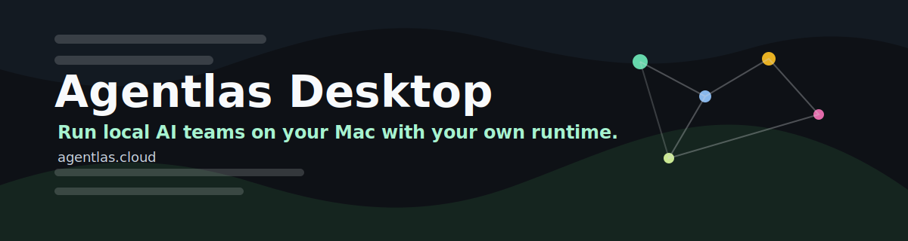
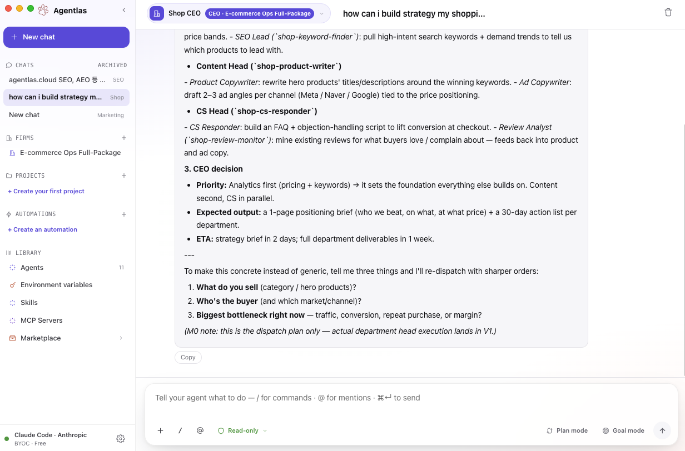

<p align="center">
  
</p>

<h1 align="center">Agentlas Desktop</h1>

<p align="center">
  <strong>The open-source control room for your AI agents — on macOS, Windows, and Linux.</strong>
</p>

<p align="center">
  <a href="https://agentlas.cloud">agentlas.cloud</a>
  ·
  <a href="https://agentlas.cloud/desktop">Desktop page</a>
  ·
  <a href="https://github.com/jeongmk522-netizen/agentlas-desktop/releases/latest">Releases</a>
  ·
  <a href="#documentation">Docs</a>
</p>

<p align="center">
  <a href="https://github.com/jeongmk522-netizen/agentlas-desktop/releases/latest">
    
  </a>
  <a href="LICENSE">
    
  </a>
  
  
</p>

Connect the AI models you already pay for, import agents over MCP, and run whole
agent teams from one local window — with the org chart and the repo behind every
run in plain view. Your keys and your chat history stay on your machine, never on
someone else's agent platform.

- **Bring your own models.** Claude, Codex, and Gemini (CLI or API key), or
  OpenAI / Anthropic / Google directly. Agentlas never proxies the model call.
- **Import agents over MCP.** Drop in an agent or a whole team — for example a
  package you built on [agentlas.cloud](https://agentlas.cloud) — and run it.
- **See the team, not a black box.** Every agent team renders as an org chart and
  a file tree, so you can see who does what and which repo each run touches.
- **Run and orchestrate locally.** The app supervises the agent processes and
  routes work between roles, all on your disk.
- **Local-first.** Keys in the OS keychain, chats and installed agents in local
  SQLite. Open source, Apache-2.0 — fork it, audit it, ship a variant.

<p align="center">
  
</p>

## Features

| | |
|---|---|
| **Bring-your-own runtime** | Route every run through a local CLI (`claude-code`, `codex`, `gemini`) or a BYOK cloud key (Anthropic / OpenAI / Google). Agentlas detects installed CLIs automatically and never proxies the model call. |
| **Agent firms with an org chart** | Install a whole company of agents — a CEO that delegates to department heads and workers — and watch the hierarchy render as a live org chart. |
| **Projects & chats** | Group related chats under a project with a shared context note. Messages are stored in local SQLite; archive or delete anytime. |
| **Working-folder panel** | Pin a folder to a chat so you can see (read-only) the repo or files an agent is working against. |
| **MCP-native installs** | Install approved bundles from the `agentlas.cloud` marketplace and run them through local runtime adapters over the Model Context Protocol. |
| **Library** | One place to manage installed agents, skills, MCP servers, and the shared environment-variable vault. |
| **Automations** | Schedule recurring agent or firm runs from a prompt template (UI shipping in M0; persistent scheduler in V1). |
| **Secrets in the OS keychain** | API keys and integration tokens live in the macOS/Windows/Linux keychain via the main process — never in a plaintext file, never exposed to the renderer. |
| **Auto-updates** | Signed update feed via GitHub Releases; a "Restart to update" badge appears when a new build is downloaded. |
| **Bilingual** | Full Korean / English UI with automatic locale detection. |
| **Cross-platform** | Electron Builder produces macOS `.dmg`, Windows installer + portable `.exe`, and Linux `AppImage` + `.deb`. |

## Screens

| Screen | What it does |
|--------|--------------|
| **Home** | Landing dashboard — recent chats, installed teams, quick actions. |
| **Chat** | One-on-one conversation with an agent or a firm's CEO. Supports image attachments on BYOK backends. |
| **Archived chats** | Chats you've archived — hidden from the sidebar, restorable anytime. |
| **Projects** | Create and open projects; each carries a default agent and a shared context note. |
| **Firm detail** | The agent company's org chart — CEO → department heads → workers, plus the firm persona. |
| **Automations** | List, create, and toggle scheduled runs targeting an agent or a firm. |
| **Library · Agents** | Installed agents, their tone/persona, and trust grade. |
| **Library · Skills** | Skills available to your installed agents. |
| **Library · MCPs** | Installed MCP servers and their manifests. |
| **Library · Env** | The shared environment-variable vault — which keys are set and which agents require them. |
| **Marketplace** | Browse and install agents and firms from `agentlas.cloud` (with an offline in-memory fallback). |
| **Settings** | Backend connections, BYOK API keys, language, and migration from OpenClaw / Hermes. |
| **Onboarding** | First-run wizard: welcome → connect a backend → menu tour → install your first team. |

## LLM Providers

Agentlas connects to models two ways — through a **local CLI** you already have
installed, or with a **cloud API key (BYOK)**. Either way the call goes straight
from your machine to the provider; Agentlas never sits in the middle.

| Provider | How it connects | Notes |
|----------|-----------------|-------|
| **Claude Code** | Local CLI (`claude-code`) | Auto-detected. Uses your existing Claude subscription/login. |
| **Codex** | Local CLI (`codex`) | Auto-detected. Uses your existing ChatGPT/OpenAI login. |
| **Gemini** | Local CLI (`gemini`) | Auto-detected. Uses your existing Google login. |
| **Anthropic** | BYOK API key | `console.anthropic.com → API Keys`. Stored in the OS keychain. |
| **OpenAI** | BYOK API key | `platform.openai.com/api-keys`. Stored in the OS keychain. |
| **Google (Gemini)** | BYOK API key | `aistudio.google.com/app/apikey`. Stored in the OS keychain. |

You need **one** of these to start — a single detected CLI or a single API key.
Add more later in **Settings**.

## Quick install

Get the latest build from the [**Releases page**](https://github.com/jeongmk522-netizen/agentlas-desktop/releases/latest).

| OS | File | Notes |
|----|------|-------|
| macOS (Apple silicon) | `Agentlas-x.y.z-arm64.dmg` | M1 and newer |
| macOS (Intel) | `Agentlas-x.y.z-x64.dmg` | Intel Macs |
| Windows | `Agentlas-Setup-x.y.z.exe` · `Agentlas-x.y.z-portable.exe` | Windows 10/11 (x64) |
| Linux | `Agentlas-x.y.z.AppImage` · `Agentlas-x.y.z.deb` | x64 |

The app updates itself — a "Restart to update" badge appears when a new build is
ready.

### First-time setup — opening the app the first time

Agentlas Desktop is open source and the public builds aren't paid code-signed on
every platform, so your OS may ask you to confirm the first launch. This is normal
for indie/open-source apps and happens only once.

**macOS** — if you see *"Agentlas can't be opened because Apple cannot check it
for malicious software"*, right-click the app in Applications → **Open** →
**Open**. Or, in Terminal:

```bash
xattr -dr com.apple.quarantine /Applications/Agentlas.app
open /Applications/Agentlas.app
```

**Windows** — if SmartScreen shows *"Windows protected your PC"*, click
**More info** → **Run anyway**. The portable `.exe` runs without installing.

**Linux** — make the AppImage executable and run it:

```bash
chmod +x Agentlas-*.AppImage
./Agentlas-*.AppImage
# no FUSE on your distro? run:
./Agentlas-*.AppImage --appimage-extract-and-run
```

(Or install the `.deb`: `sudo dpkg -i Agentlas-*.deb`.)

## Getting Started

After installing, the first-run wizard walks you through it — but here's the whole
flow:

1. **Open the app** and let the welcome screen finish (first launch only).
2. **Connect a backend.** Agentlas auto-detects any installed `claude-code`,
   `codex`, or `gemini` CLI. No CLI? Paste an Anthropic / OpenAI / Google API key —
   it goes straight into the OS keychain.
3. **Install a team or an agent** from the **Marketplace**. Try a firm (a CEO plus
   its departments) or a single specialist.
4. **Start a chat** from the sidebar. Pick the agent (or the firm's CEO) and type.
5. **Pin a working folder** (optional) so the agent can see the repo it's helping with.
6. **Add automations** for recurring runs, and manage everything from **Library**.
7. **Coming from OpenClaw or Hermes?** Jump to
   [Migrating from OpenClaw](#migrating-from-openclaw) to bring your SOUL, keys,
   and automations across.

## CLI runtime vs Cloud (BYOK) — quick reference

Agentlas has no separate "CLI app" and "web app" — it's one desktop window. The
choice that matters is **how each run reaches a model**: through a local CLI you've
already logged into, or through a cloud API key you paste in. Both run from your
machine; here's how they differ.

| Action | Local CLI runtime | Cloud API key (BYOK) |
|--------|-------------------|----------------------|
| Connect | Auto-detected (`claude-code` / `codex` / `gemini`) | Paste a key in **Settings → BYOK** |
| Who pays | Your existing subscription / login | Your API account, metered per token |
| Where the key lives | The CLI's own login | The OS keychain (never a file) |
| Works offline-ish | Whatever the CLI supports | No — direct cloud calls |
| Image attachments | Ignored by the CLI (a warning is shown) | Sent as multimodal input |
| Switch active backend | **Settings** → pick a detected runtime | **Settings** → pick a saved key |
| Version pinning | Follows the installed CLI version | Follows the provider's API |

> Agentlas never routes either path through its own servers. The model call goes
> from your machine straight to Anthropic / OpenAI / Google.

## Migrating from OpenClaw

Already running a terminal-style assistant like **OpenClaw**? Bring it across in the
app — **Settings → 다른 도구에서 가져오기 (Import from another tool)**.

Agentlas scans `~/.openclaw` and shows a preview (names and counts only — no secret
values ever leave the main process). Click **Import** and it brings over:

- **Your agent's SOUL / persona** (`workspace/SOUL.md`, `IDENTITY.md`, `USER.md`,
  `AGENTS.md`, `TOOLS.md`) → a new installed agent you can chat with immediately.
- **API keys** from `~/.openclaw/.env` → the OS keychain. Recognized provider keys
  (`OPENAI_API_KEY`, `ANTHROPIC_API_KEY`, `GEMINI_API_KEY`, …) become BYOK backends;
  other `*_API_KEY` / `*_TOKEN` secrets go into the shared env vault.
- **Scheduled jobs** (`cron/jobs.json`) → automations targeting the imported agent.
- **Memories / workspace** → a "OpenClaw 마이그레이션" project whose context note
  points at your original workspace so you can pin it as a working folder.

Options:

- **Dry run** — preview exactly what would be imported, writing nothing.
- **Overwrite** — re-import on top of a previous import (updates the agent in place).

> Imported automations are session-only in the current M0 build; the persistent
> scheduler lands in V1. Everything else (agent, keys, project) persists.

### Migrating from Hermes

The same importer reads **Hermes** (`~/.hermes`, or `%LOCALAPPDATA%\hermes` on
Windows): `SOUL.md` and workspace instructions become the agent persona, `.env`
keys go to the keychain, and `memories/` are surfaced as a project. Pick **Hermes**
in the same Settings panel.

## Build from source

Requirements: Node.js 20+, npm. (macOS also needs Xcode Command Line Tools, and
Linux needs `libsecret-1-dev`, for the native modules.)

```bash
git clone https://github.com/jeongmk522-netizen/agentlas-desktop.git
cd agentlas-desktop
npm install
npm run dev        # Next.js renderer on :3100 + Electron
```

```bash
npm run typecheck  # TypeScript for electron main + renderer
npm run build      # export renderer + compile electron into dist/
```

Package an installer (unsigned — fine for local use):

```bash
npm run dist:win            # Windows: NSIS installer + portable .exe
npm run dist:linux          # Linux: AppImage + .deb
npm run dist:mac:unsigned   # macOS: unsigned .dmg (no Apple cert needed)
```

Output lands in `release/`. Releases for the public download page are built by
the cross-platform GitHub Actions workflow (`.github/workflows/release.yml`) on a
tag push — see [`docs/PUBLIC-RELEASE.md`](docs/PUBLIC-RELEASE.md). End users don't
need any of that.

## Architecture

```text
Agentlas Desktop
├─ electron/          privileged main process
│  ├─ runtime/        Claude Code, Codex, Gemini, BYOK adapters
│  ├─ mcp/            MCP client and installer
│  ├─ marketplace/    agentlas.cloud marketplace source
│  ├─ migrate/        OpenClaw / Hermes importer
│  ├─ secrets/        OS keychain vault
│  ├─ store/          SQLite-backed local state
│  └─ updater.ts      electron-updater integration
├─ renderer/          Next.js App Router UI
├─ shared/            typed IPC contracts
├─ scripts/           release, signing, and verification tooling
└─ docs/              architecture and release notes
```

The renderer never gets direct filesystem, keychain, or process-supervision
access — it talks to the main process through a typed preload bridge.

## Documentation

| Document | Covers |
|----------|--------|
| [docs/ARCHITECTURE.md](docs/ARCHITECTURE.md) | Process model, IPC bridge, runtime adapters, data flow. |
| [docs/M0-CHECKLIST.md](docs/M0-CHECKLIST.md) | The M0 spike scope and what's verified. |
| [docs/PUBLIC-RELEASE.md](docs/PUBLIC-RELEASE.md) | Cross-platform CI release + the signed/notarized macOS path. |
| [CONTRIBUTING.md](CONTRIBUTING.md) | How to set up, what to test, and the public-safety rules. |
| [SECURITY.md](SECURITY.md) | How to report a vulnerability. |
| [Migrating from OpenClaw](#migrating-from-openclaw) | Bring a SOUL, keys, and automations over from OpenClaw / Hermes. |

## Security model

- No credentials in Git.
- No API keys written to plaintext local files.
- Renderer code cannot directly read secrets.
- Migration previews send key **names** only — secret values never leave the main process.
- Signing material is git-ignored and injected only during release.
- Auto-update assets are served from GitHub Releases.

Security reports: see [SECURITY.md](SECURITY.md).

## Contributing

Pull requests are welcome. Start with [CONTRIBUTING.md](CONTRIBUTING.md), run
`npm run typecheck`, and keep public safety in mind: no credentials, no local
logs, no signing material. Windows/Linux testing and packaging feedback is
especially appreciated.

## License

Apache License 2.0. See [LICENSE](LICENSE) and [NOTICE](NOTICE).
