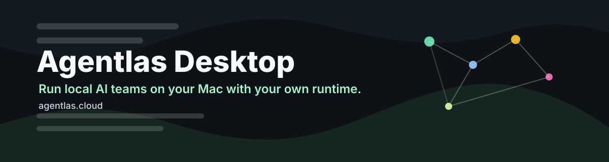
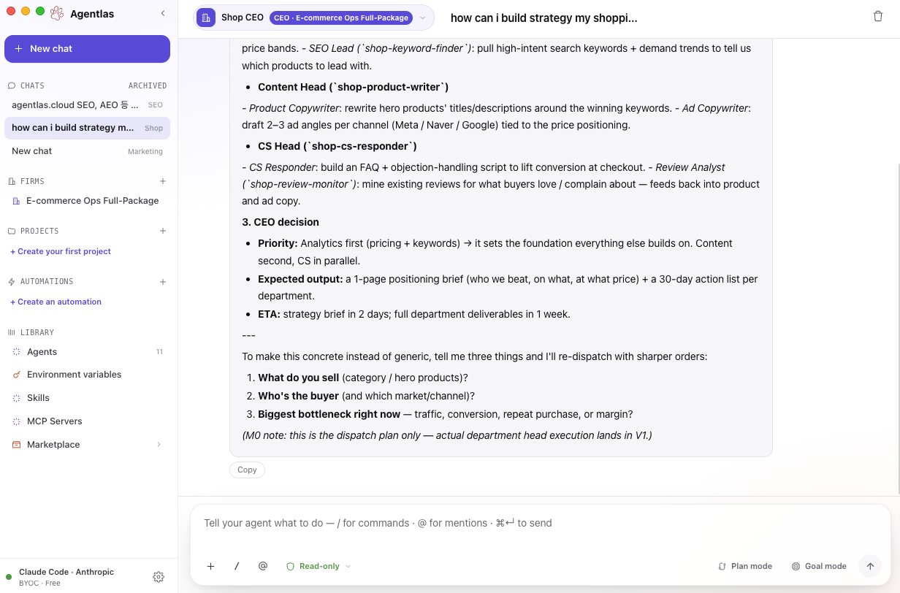

<p align="center">
  
</p>

<h1 align="center">Agentlas Desktop</h1>

<p align="center">
  <strong>We are Agent Trust. Your agent is not a program. It is an asset. — Agentlas —</strong>
</p>

<p align="center">
  Build the agent you need, borrow a public Hub specialist, and run it through a supported LLM and computer you choose.<br>
  Agentlas Desktop is the primary local GUI runtime: model calls, tool use, file access, and credentials stay under that host's permissions.
</p>

<p align="center">
  Agent Cloud stores and restores your private, owner-scoped agent packages. Hub publication is a separate public action.<br>
  <sub><strong>Agent Trust</strong> is a product principle for ownership and portability, not a financial, legal, custody, or fiduciary service.</sub>
</p>

<!-- ── Download (primary action) ───────────────────────────────────────── -->
<p align="center">
  <a href="https://github.com/agentlas-ai/agentlas-desktop-releases/releases/latest">
    
  </a>
  <a href="https://github.com/agentlas-ai/agentlas-desktop-releases/releases/latest">
    
  </a>
  <a href="https://github.com/agentlas-ai/agentlas-desktop-releases/releases/latest">
    
  </a>
  <a href="https://github.com/agentlas-ai/agentlas-desktop-releases/releases/latest">
    
  </a>
</p>
<p align="center">
  <sub>Free · open source (Apache-2.0) · Agentlas sign-in connects the app, Cloud, and Hub · your LLM subscription and API credentials stay local · prefer a standalone terminal? <a href="https://github.com/agentlas-ai/agentlas-terminal">Agentlas Terminal ↗</a></sub>
</p>

<p align="center">
  <a href="https://agentlas.cloud">agentlas.cloud</a>
  ·
  <a href="https://agentlas.cloud/desktop">Desktop page</a>
  ·
  <a href="https://github.com/agentlas-ai/agentlas-desktop-releases/releases/latest">Download</a>
  ·
  <a href="#documentation">Docs</a>
</p>

<p align="center">
  <a href="https://github.com/agentlas-ai/agentlas-desktop-releases/releases/latest">
    
  </a>
  <a href="LICENSE">
    
  </a>
  
  
</p>

<p align="center">
  
</p>

## Release log

Canonical release history lives in [CHANGELOG](CHANGELOG.md) and the
[Releases page](https://github.com/agentlas-ai/agentlas-desktop-releases/releases/latest) (the public download/auto-update channel).
This README keeps the newest source release note. The Releases page remains the
authority for which version is actually public, stable, and downloadable.

- **2026-09-06 · v1.1.3 — Science research and reliable Linux packaging** — Includes the One, Work, and Science improvements listed below, with independent Science model selection, continued research runs, Ollama setup navigation, and document navigation that fits narrow Work panels. Linux applies its AppImage relaunch guard when the launcher is created. This release binds Agentlas OS v1.2.44 at 1f6d64374502cfd5f8581ad3c1fb18691ed61b1d. Its public runtime asset `hephaestus-runtime-v1.2.44.tar.gz` is pinned at SHA-256 `795d1c294db662475d4eb0c7e4562ba0ca1e0f27d3b1da0f5e9c6e7cf627d83a`. Source readiness does not prove a public installer or update feed; the Releases page stays the authority.

- **2026-09-03 · v1.1.2 — Durable One/Work results and safer team execution** — One preserves image attachments while creating a conversation and separates media from chat text. Work keeps free-text question answers, result tabs, generated-media copy/download, and per-chat execution identity durable across stop, retry, and reload. A direction sent during an interactive One or Work run is durably saved before the old turn is interrupted and then continues in the same conversation; automation and remote queues remain sequential. Runtime traces redact credentials, write-capable team turns are serialized per project, and completion requires concrete execution evidence. Linux AppImage relaunch and signed Science extension key compatibility are also repaired. This release binds Agentlas OS v1.2.44 at 1f6d64374502cfd5f8581ad3c1fb18691ed61b1d. Its public runtime asset `hephaestus-runtime-v1.2.44.tar.gz` is pinned at SHA-256 `795d1c294db662475d4eb0c7e4562ba0ca1e0f27d3b1da0f5e9c6e7cf627d83a`. Source readiness does not prove a public installer or update feed; the Releases page stays the authority. This is a source state; the Releases page remains the authority for public installers.
- **2026-09-03 · v1.1.1 — Safer upgrades and clearer automation state** — Desktop preserves the installed app and local user data until a staged, signed replacement passes trust checks, retains dependent database triggers during upgrade, verifies browser sessions instead of equating imported cookies with login, and keeps graph controls, permission failures, growing chat input, attachments, and compact activity rows usable. Science remains an independently downloaded signed extension. This release binds Agentlas OS v1.2.40 at 0c29abdb9505df32b61522861a17bbc537de5263. Its public runtime asset `hephaestus-runtime-v1.2.40.tar.gz` is pinned at SHA-256 `f07527e45fa6be4538898a60e05e5113a72d2de2c61e2e021c1163954c5ba8c2`. Source readiness does not prove a public installer; the Releases page stays the authority.
- **2026-09-02 · v1.1.0 — Science workspace, durable One results, and one app-owned runtime** — Agentlas Desktop now exposes Science as a product surface and can download the signed Science 0.1.0 workspace plus its Ketcher and Molstar renderer packs from the Desktop settings flow. One records generated media and documents as durable results, opens substantial output in right-side tabs, and can route ordinary-language requests to installed workflows such as Design without requiring tool names. The internal `agentlasd` helper and Mobile Bridge are bound to the live Desktop instance and stop with it instead of leaving hidden local work behind. Downloads are size- and hash-checked, verified against release-owned public keys, and activated atomically; an absent or failed package remains an explicit failure instead of an enabled-looking partial install. This release binds Agentlas OS v1.2.40 at 0c29abdb9505df32b61522861a17bbc537de5263. Its public runtime asset `hephaestus-runtime-v1.2.40.tar.gz` is pinned at SHA-256 `f07527e45fa6be4538898a60e05e5113a72d2de2c61e2e021c1163954c5ba8c2`. Source readiness does not prove a public installer; the Releases page stays the authority.
- **2026-09-01 · v1.0.58 — One opens the conversation you meant, and work reads like work** — Sessions are one latest-first list without date buckets, clicking One or an organisation agent opens that owner's newest conversation, and selecting a group chat no longer leaves One looking selected. A small red dot on the Sessions tab carries attention from another conversation without interrupting the current one. Thinking and tool activity now use compact Codex-style rows with completed work folded behind a `Worked for` summary. Settings keeps the skills, host hooks, and adapter-manifest editor collapsed until the user expands it, while preserving the existing file list and save behavior. This release binds Agentlas OS v1.2.38 at fc310b5898b44f5a84034fb25f724321de450509. Its public runtime asset `hephaestus-runtime-v1.2.38.tar.gz` is pinned at SHA-256 `a8819cfae2c7aaa7791763545414dc477b6df3aec87488ac3dea9cca9865e570`. Source readiness does not prove a public installer; the Releases page stays the authority.
- **2026-08-30 · v1.0.57 — Startup and One surfaces report the state they actually have** — Missing imported agent source folders remain visible and recoverable, startup navigation failures are classified before incident reporting, and One carries approval, cancellation, and tool-failure causes through live rows and durable replay. Team preflight expiry and stale acknowledgements stay bounded, while release packaging checks the exact embedded engine and host-hook manifests. This release binds Agentlas OS v1.2.38 at fc310b5898b44f5a84034fb25f724321de450509. Its public runtime asset `hephaestus-runtime-v1.2.38.tar.gz` is pinned at SHA-256 `a8819cfae2c7aaa7791763545414dc477b6df3aec87488ac3dea9cca9865e570`. Source readiness does not prove a public installer; the Releases page stays the authority.
- **2026-08-30 · v1.0.56 — Model labels match the runtime that will actually run** — Omitting a CLI model now says `Use engine setting`, and default effort is labelled separately. BYOK, local runtimes, and Agentlas serving require a concrete model such as Agentlas Light instead of offering an invented subscription or provider default; malformed legacy rows say that no model is specified. Dashboard, One, New Agent, automation pins, and run history use the same rule. This release binds Agentlas OS v1.2.37 at 2b169ba44742735d1ce7f550fefee071b70324fc. Its public runtime asset `hephaestus-runtime-v1.2.37.tar.gz` is pinned at SHA-256 `50caf78a9c028fcf088039dd862753c25fbb9bed19df9fa248502b442dc306a6`. Source readiness does not prove a public installer; the Releases page stays the authority.
- **2026-08-30 · v1.0.55 — One model picker, aligned role rows** — Dashboard role defaults now combine the provider/runtime identity and model choice in one logo-backed picker matching the shared model catalog, while effort remains the only separate selector. Priority, fallback, unavailable-state, keyboard, and narrow-window behavior are preserved. This release binds Agentlas OS v1.2.37 at 2b169ba44742735d1ce7f550fefee071b70324fc. Its public runtime asset `hephaestus-runtime-v1.2.37.tar.gz` is pinned at SHA-256 `50caf78a9c028fcf088039dd862753c25fbb9bed19df9fa248502b442dc306a6`. Source readiness does not prove a public installer; the Releases page stays the authority.
- **2026-08-30 · v1.0.54 — Runtime identity, safe graph packages, and clearer cross-surface actions** — This release binds Agentlas OS v1.2.37 at 2b169ba44742735d1ce7f550fefee071b70324fc. Its public runtime asset `hephaestus-runtime-v1.2.37.tar.gz` is pinned at SHA-256 `50caf78a9c028fcf088039dd862753c25fbb9bed19df9fa248502b442dc306a6`. Dashboard and automation controls keep provider/engine as identity while model and effort are the choices, with exact automation pins visible in history; One confirms existing-agent additions explicitly, and browser/Telegram flows retain their owned identity boundaries. Graph exports recursively remove or block credential material, bind both graph and manifest digests, and retain every dependent node. Source readiness does not prove a public installer; the Releases page stays the authority.
- **2026-08-29 · v1.0.53 — Multimodal setup and agent growth say what they actually do** — This release binds Agentlas OS v1.2.37 at 2b169ba44742735d1ce7f550fefee071b70324fc. Its public runtime asset `hephaestus-runtime-v1.2.37.tar.gz` is pinned at SHA-256 `50caf78a9c028fcf088039dd862753c25fbb9bed19df9fa248502b442dc306a6`. The dashboard can now add and retain the image-generation role, offers only its executable Codex and Antigravity adapters, keeps the selected engine exact instead of silently substituting another provider, and keeps video/API providers in the dedicated multimodal settings. Growth cards now distinguish approval-waiting proposals from low-risk changes that were already applied automatically, and show the promised rollback safety before the person acts. Source readiness does not prove a public installer; the Releases page stays the authority.
- **2026-08-29 · v1.0.52 — Packaged startup uses real plugin files without deprecated ASAR stats** — This release binds Agentlas OS v1.2.37 at 2b169ba44742735d1ce7f550fefee071b70324fc. Its public runtime asset `hephaestus-runtime-v1.2.37.tar.gz` is pinned at SHA-256 `50caf78a9c028fcf088039dd862753c25fbb9bed19df9fa248502b442dc306a6`. Built-in plugin releases now materialize from real unpacked files, preserving exact mode, digest, and symlink checks without Electron's deprecated synthetic `fs.Stats`; renderer routing uses ASAR-native directory entries, and the isolated macOS candidate fetches its pinned private Node before packaging. Source readiness does not prove a public installer; the Releases page stays the authority.
- **2026-08-29 · v1.0.51 — A verified OS cooldown no longer looks like an unknown update** — This release binds Agentlas OS v1.2.37 at 2b169ba44742735d1ce7f550fefee071b70324fc. Its public runtime asset `hephaestus-runtime-v1.2.37.tar.gz` is pinned at SHA-256 `50caf78a9c028fcf088039dd862753c25fbb9bed19df9fa248502b442dc306a6`. When Core skips a repeated install as `already_applied_recently`, the dashboard now reports current only if the journal also proves the exact current/latest version match; every other skipped or uncomparable state remains unknown. Source readiness does not prove a public installer; the Releases page stays the authority.
- **2026-08-29 · v1.0.50 — Model and effort usage is visible** — This release binds Agentlas OS v1.2.37 at 2b169ba44742735d1ce7f550fefee071b70324fc. Its public runtime asset `hephaestus-runtime-v1.2.37.tar.gz` is pinned at SHA-256 `50caf78a9c028fcf088039dd862753c25fbb9bed19df9fa248502b442dc306a6`. The dashboard now shows locally observed tokens and invocation counts for each exact orchestrator/worker model·effort pair. Codex and Claude provider quota windows remain account-level because their APIs do not expose per-model percentages. Chat and task-force receipts persist the runner-applied effort (including Spark `max` → `xhigh` clamping), legacy rows recover it only from the matching runtime-selection receipt, and switching models clears an effort the new model does not advertise. Source readiness does not prove a public installer; the Releases page stays the authority.
- **2026-08-29 · v1.0.49 — Actions wait for the result they actually changed** — This release binds Agentlas OS v1.2.37 at 2b169ba44742735d1ce7f550fefee071b70324fc. Its public runtime asset `hephaestus-runtime-v1.2.37.tar.gz` is pinned at SHA-256 `50caf78a9c028fcf088039dd862753c25fbb9bed19df9fa248502b442dc306a6`. One, Work, automation, settings, workspace, browser, and Mobile actions now commit their visible state only after an exact Desktop receipt or authoritative readback agrees with the requested action; ambiguous response loss preserves the draft or action identity and does not invite a duplicate run. Mobile Work keeps the exact Task/chat and selected runtime, remote terminal writes reuse one action key until confirmed, and bundled plugins are installed through complete staged atomic swaps so removed files disappear, host state survives, concurrent installs serialize, and a failed partial update cannot present itself as current. Source readiness does not prove a public installer; the Releases page stays the authority.
- **2026-08-28 · v1.0.48 — Actions finish where the person expects them to** — This release binds Agentlas OS v1.2.34 at 2f344a6fafdd96c1130c611c4817bf50e3dce773. One search results reopen the exact conversation, handled team confirmations stay handled, and completed replies are committed before the UI reports completion. Desktop, Mobile, and Graph now retain their run IDs, steering, unread state, final evidence, and failure boundaries through restart and reconnect paths. The shared SQLite store no longer removes or truncates live WAL/SHM files, and its checkpoint, migration, shutdown, and window-reopen work is ordered so a finished action is not lost to a competing lifecycle event. Source readiness does not prove a public installer; the Releases page stays the authority.
- **2026-08-27 · v1.0.47 — Bounded MCP result rendering and runtime-pinned automation recovery** — Bundled runtime: Agentlas OS v1.2.29 (f3722c6c3bcc709103ce304fc94fb09f1ace44db). Work and One now render bounded MCP text, status, data, links/files, inline media, and embedded resources; sidebar media visibility is user-controlled, and automation/graph recovery preserves saved runtime pins with host-observed failure evidence. Source readiness does not prove a public installer; the Releases page stays the authority.
- **2026-08-27 · v1.0.46 — An app that will not open now shows a way out** — Bundled runtime: Agentlas OS v1.2.29 (f3722c6c3bcc709103ce304fc94fb09f1ace44db). A recovery screen existed for exactly this, but it gave up the moment a model could not be reached, which is what a signed-out launch looks like, and an offline one, and a usage limit. Measured on one machine: a startup failure left a window with no words and no buttons for thirty-five minutes until a person launched the app again by hand. The things that can be done are already decided in code and need no model, so they are now offered as they are, alongside the fact that conversations, agents, and settings are untouched. Source readiness does not prove a public installer; the Releases page stays the authority.
- **2026-08-27 · v1.0.45 — An app left open no longer goes quiet and stop taking its updates** — Bundled runtime: Agentlas OS v1.2.29 (f3722c6c3bcc709103ce304fc94fb09f1ace44db). Measured on one machine: four hours without a single line written, the process alive but no longer recognised as an application, and update checks stopped, so it sat on an old version with a fix already waiting for it. None of it was visible, because the record that exists to show such things was the thing that had stopped. The size ceiling is now checked as lines are written rather than only at startup, a dropped handle is reopened instead of silencing the rest of the session, and a log removed out from under a live handle is noticed instead of swallowing every line after it. Source readiness does not prove a public installer; the Releases page stays the authority.
- **2026-08-26 · v1.0.44 — A delivered message is no longer marked as failed** — Bundled runtime: Agentlas OS v1.2.29 (f3722c6c3bcc709103ce304fc94fb09f1ace44db). A teammate's full answer sat on screen while the line carrying it, and the line that had asked for it, both read "Delivery failed". The run had failed, but much later and for an unrelated reason: the final step ran into the model's usage limit. That ending rose to the whole exchange, so everything inside it was painted as failed including what had plainly arrived. Arrival does not reverse — a teammate speaking is the evidence that the work reached them and came back — while a request that never got an answer still says so. Source readiness does not prove a public installer; the Releases page stays the authority.
- **2026-08-26 · v1.0.43 — Improving an agent no longer kills what it learned** — Bundled runtime: Agentlas OS v1.2.29 (f3722c6c3bcc709103ce304fc94fb09f1ace44db). A chip only attached to the exact build it was measured on, so publishing a fix stopped promotion, collection, export, cloud sync, and attachment all at once — and renaming an agent did the same, because the record was keyed by the name. A chip now belongs to the agent, and the build it was measured on is kept as a note rather than a gate. Experience that had already split apart is put back together: because the draft was also found by the build number, republishing quietly started a second draft, so the same memories were collected again and you were asked to review chips you had already approved — the drafts are merged, keeping the one you actually worked in, and nothing is deleted. Learning filed under an org-chart position that had no agent behind it, where nothing could ever read it back, is returned to the team's shared memory. An agent and a team that share a name are both shown again instead of both being hidden, and the same agent no longer appears twice on the phone after a republish. Removing an agent works again — deletion was refused outright in six places — and removing a Telegram connection no longer destroys the bot's token with it. Teams carry their kind in their own identity and every member now has one of its own, so what a member learns accrues to that member. Identity is never written into your own agent folder, which would have blocked the next update outright. Upgrading from a v0.7.0 database is proven, not assumed. Source readiness does not prove a public installer; the Releases page stays the authority.
- **2026-08-26 · v1.0.42 — Borrowed public agents run again, and the bundled engine moves thirteen versions forward** — Bundled runtime: Agentlas OS v1.2.29 (f3722c6c3bcc709103ce304fc94fb09f1ace44db). Preparing a borrowed teammate refused every public listing because the stored seal number no longer matched a fresh recount — the contents were identical, only the number differed — so a paid seat opened onto nothing; identity is still checked and the recount is now recorded instead of blocking. The Desktop ships the engine inside itself, so engine work could not reach anyone here until this pin moved: staffing shortlists four candidates instead of eight (the right one was inside the top four in 97.4% of measured cases), a role can be searched with several phrasings at once, tools are found in two steps instead of loading every schema, and a Korean role name no longer collapses into an empty concept that wiped out every candidate. Signing in is one command. The model you chose is now the model that runs: work was handed to a picker that could reach for anything installed on the machine, so setting the orchestrator, One, and every seat to one model still left it choosing something else — the picker now chooses only from what you put in that seat. Separately, a teammate's answer is no longer thrown away by the last step: when a borrowed teammate replied and the final summary then hit its model's usage limit, the whole turn was marked failed while the replies sat there on screen — the summary now continues once on another live model, exactly as teammate runs already did. Running into a usage limit says which model stopped, what to do, and that delivered replies are still above. Source readiness does not prove a public installer; the Releases page stays the authority.
- **2026-08-26 · v1.0.41 — A group chat with a borrowed teammate is no longer turned away** — Bundled runtime: Agentlas OS v1.2.16 (6d0d7e7eafaa96ebbed92e1a2223b01f13eed245). Seating an agent borrowed from the Hub used to leave it out of the run; that was fixed, but two later points still turned the whole roster away for not being locally installed, so those rooms stopped starting at all — five sends across three rooms produced zero runs while a local-only room ran fine. A borrowed teammate is called by name rather than installed, so it has no installed version to pin and no installed identity to invent; both points now ask whether the roster is the one this app itself built. Measured live: the run now starts and works for as long as its local part takes, then still stops at the borrow call, because every leased listing on the test account answers that its exact release is not eligible to run — that is on the Hub side, reproduces without this app, and no Desktop version fixes it. This release removes the Desktop wall, not the whole one. Adding a teammate no longer asks for the same name and character twice or squeezes the candidate list into a strip too narrow to choose from, and the button offering to swap who holds a seat now does something. Eighteen panels and sheets slide instead of snapping, with dragging exempt and motion reduced to nothing when the system asks. A turn that never got an answer says so instead of sitting in progress forever, a seat someone left is actually emptied, and the preview window names what is really running rather than claiming to be a phone simulator. Seats and conversations are separate, so replacing who sits in a seat keeps the conversation. Source readiness does not prove a public installer; the Releases page stays the authority.
- **2026-08-25 · v1.0.40 — Remote access survives a website deploy** — Bundled runtime: Agentlas OS v1.2.16 (6d0d7e7eafaa96ebbed92e1a2223b01f13eed245). The relay that carries your phone through to this Desktop used to live inside the website process, so every website deploy closed it and each connected phone fell off. The relay is now its own service, and the Desktop asks the server where it lives instead of assuming, so it can move again later without another update. If the server cannot answer, the Desktop keeps the address it already had, and phones already paired follow along without scanning anything again. One also picks up eight fixes found by walking the product as a user: activity shows what actually happened, the bottom sheet stops covering the composer, creating an agent no longer loses a field you filled in, and the org chart stops collapsing when a member has no title. Source readiness does not prove a public installer; the Releases page stays the authority.
- **2026-08-25 · v1.0.39 — Sessions side by side, one shape for every question, and group chats that actually call their members** — Bundled runtime: Agentlas OS v1.2.16 (6d0d7e7eafaa96ebbed92e1a2223b01f13eed245). Up to four sessions open beside each other, each a whole conversation with its own composer and outputs. Every place the app asks you to choose now uses one card with the same shape, and each answer carries a line explaining what it does. The outputs panel no longer opens itself, opens at half its old width, and shows one tab per real output instead of four fixed ones. A report an agent writes is rendered as a document you can take away as Markdown or PDF, and whether something is a report is the agent's own call. Group chats call their members again: a room of three used to answer with One alone because the roster never looked at the room, a team package was always skipped, one member who could not come discarded the whole roster, and confirming a team never reached execution. Team result cards no longer vanish on runtimes that do not attach output paths. Source readiness does not prove a public installer; the Releases page stays the authority.
- **2026-08-24 · v1.0.38 — Readable messages, and the conversation you were in** — Bundled runtime: Agentlas OS v1.2.16 (6d0d7e7eafaa96ebbed92e1a2223b01f13eed245). What you typed to One was dark text on a dark bubble because the body is painted through a different colour token than the one the bubble flipped. One also opened on an empty home every time and left team conversations out of the recent list, so there was no way back to them; it now lists them and returns to the conversation you were last in. Updating from a much older version no longer stops partway, and signing out disconnects phones that are already connected while keeping their pairings. Source readiness does not prove a public installer; the Releases page stays the authority.
- **2026-08-24 · v1.0.37 — Conversations stay put, and a broken build can repair itself** — Bundled runtime: Agentlas OS v1.2.16 (6d0d7e7eafaa96ebbed92e1a2223b01f13eed245). One conversations no longer vanish from the home screen when Work is busy, a sub-session inherits the surface that started it, deleting a bot keeps the chats you had with it, and a question the bot never filled in is not shown at all. A missing built-in plugin no longer stops the app from starting, so a mis-packaged build can update itself out of trouble, and an update is re-checked against the feed immediately before it installs. On a Mac without Node.js the app now carries its own, and the approval banner no longer sits under the window controls. Source readiness does not prove a public installer; the Releases page stays the authority.
- **2026-08-23 · v1.0.36 — Readable briefing settings, right-sized panels, 30 MB packages** — Bundled runtime: Agentlas OS v1.2.16 (6d0d7e7eafaa96ebbed92e1a2223b01f13eed245). Briefing labels no longer clip to "How of…", each settings panel opens at a width that suits it, and cloud agent packages may be up to 30 MB (6 MB per file). Source readiness does not prove a public installer; the Releases page stays the authority.
- **2026-08-23 · v1.0.35 — Pick your teammate's face, and read your own messages** — Bundled runtime: Agentlas OS v1.2.16 (6d0d7e7eafaa96ebbed92e1a2223b01f13eed245). Seating an agent now offers the same character picker as creating one, and editing a teammate reuses that window for name and picture. Team packages stop scattering their internal roles through the add list, duplicate imports of a vanished folder merge, the dark user bubble no longer hides its own text, and an attachment lines up with the message box. Source readiness does not prove a public installer; the Releases page stays the authority.
- **2026-08-23 · v1.0.34 — Cloud publish receipts tell the truth** — Bundled runtime: Agentlas OS v1.2.16 (6d0d7e7eafaa96ebbed92e1a2223b01f13eed245). A live publish is no longer shown as a failed upload, and server-withheld package files are named in the result; the app now reports its running version to the server (version/OS/arch/channel/install id only) so a broken release's reach can be measured. Source readiness does not prove a public installer; the Releases page stays the authority.
- **2026-08-23 · v1.0.33 — Launch crash fix** — Bundled runtime: Agentlas OS v1.2.16 (6d0d7e7eafaa96ebbed92e1a2223b01f13eed245). 1.0.32 could not start on macOS because the signed package omitted the built-in plugin manifests; this release restores them and the packager now verifies the finished .app before it can ship. Source readiness does not prove a public installer; the Releases page stays the authority.
- **2026-08-23 · v1.0.32 — Public Hub experts take a seat in One Team** — Bundled runtime: Agentlas OS v1.2.16 (6d0d7e7eafaa96ebbed92e1a2223b01f13eed245). Call-only Hub listings can now be seated in the organisation; their runs always go through the Hub borrow path — taskforce rooms, team preflight (external workforce door), and 1:1 chats included. Source readiness does not prove a public installer; the Releases page stays the authority.
- **2026-08-23 · v1.0.31 — One Team talks like a team, and the Browser is part of the answer** — Bundled runtime: Agentlas OS v1.2.16 (6d0d7e7eafaa96ebbed92e1a2223b01f13eed245). The taskforce room reads like a conversation: characters above their words, documents rendered as documents, replies folded until you ask. The built-in Browser opens itself when the team's work is a page, survives the artifact stream and the room being reopened, and the whole PRD→approval→imagegen-consent→build journey is verified end to end on a recording from this source. Source readiness does not prove a public installer; the Releases page stays the authority.
- **2026-08-21 · v1.0.30 — A resident CLI is now a fact you can see, not an inference** — A session that stays alive after a turn ends was invisible: you could not tell what was still running, and a process that had closed looked exactly like one that never started. Residency now reports running, idle and closed for real held sessions only — a row with activity but no process is not drawn, because drawing a process that does not exist is the failure this is meant to end — and the invocation service writes those changes into the run ledger carrying the node they belong to, flattened into the diagnostic payload so an older ledger reader can still replay them. The network panel and the cockpit read that and say "CLI process closed" in as many words, and a closed node keeps its panel open rather than disappearing: that it closed is precisely the thing worth seeing. The Workforce protocol pin also moved to 2026-08-21.1, so the newly released engine is a match rather than a contract-drift warning on every staffing call. And an automation built by describing it could not have its name or schedule changed: its target is the built-in orchestrator, which the agent picker hides as a system agent, so the automation's own editor found no valid target and disabled Save, leaving "run this every ten minutes" unreachable unless the person reassigned it to a different agent — the editor now always offers back the target the automation already uses, while fresh choices stay filtered. This release binds Agentlas OS v1.2.16 at 6d0d7e7eafaa96ebbed92e1a2223b01f13eed245. Source readiness does not prove a public installer or update feed; the Releases page stays the authority.
- **2026-08-21 · v1.0.29 — An automation could do the work and still not be able to say so** — Building a mail-filing automation by describing it, then running it the way a person would, turned up five breaks that share one root: the graph knows the answer and the answer does not reach the next square. A model put one sentence in front of the JSON it was asked for; the next step could not parse it, swallowed the failure and produced an empty list — and because nothing had moved, "every file it says it moved really exists" was vacuously true, so three attachments sat untouched while the run was recorded as complete. Whether a value is read by a machine is now decided in one place, and both the author and the run ask it; values only people read stay prose. A verification could also be placed before the step producing the evidence it judges on, so a run that filed everything correctly stopped halfway with the evidence missing — an order the compiler chose, which no user could fix. And edges leaving a fork were not drawn at all: a complete chain appeared on the canvas as two disconnected clusters. A correct automation could also be recorded as failed: the completion judgment saw only the last node's output — in a graph ending in verifications, the single word "pass" — so a run that filed three attachments and a run with nothing to do looked identical. It now gets the host's record of what each step produced, and the goal the person approved when they saved the automation, so setting an unreadable invoice aside reads as the goal being met rather than a shortfall. An empty result is no longer failed on sight either — work that ran and found nothing to do passes when it says why, while an unexplained empty result still fails. And only a boundary stops a run now: a verification that checks a claim against an independent observation still fails the run, while one that merely weighs a value's quality hands its finding to the completion judgment instead of stopping work that did what was asked. And an automation built by describing it could never have its name or schedule changed: its target is the built-in orchestrator, which the picker hides as a system agent, so its own editor reported no valid target and disabled Save — the editor now always offers back the target the automation already uses. This release binds Agentlas OS v1.2.12 at 2b075361f07f25577994f0ce87f46f33ac41ec64. Source readiness does not prove a public installer or update feed; the Releases page stays the authority.
- **2026-08-20 · v1.0.28 — A fresh install could never obtain the engine, and an automation that was right could still be marked failed** — The CLI ships without the 12MB graph engine and downloads it from a release asset; the function that does the download existed but nothing called it, so anyone who had just installed hit `vendored Desktop Core is unavailable` and could not run a single automation. The keychain host, added a day earlier, resolved keytar only next to itself — the downloaded engine deliberately omits it, so the resolution threw and killed the node outright; a host now hands it the path, and a failure to find it is reported as unavailable rather than as a crash. Running all ten saved automations end to end turned up three more: a threshold watcher whose verification demanded content on the very value a branch tests for emptiness (it failed on every ordinary day while computing everything correctly), a step wired back to itself, and a loop with no branch to leave it — the first two are now repaired from the recovery panel, the third is diagnosed before the run instead of at it. This release binds Agentlas OS v1.2.12 at 2b075361f07f25577994f0ce87f46f33ac41ec64. Source readiness does not prove a public installer or update feed; the Releases page stays the authority.
- **2026-08-19 · v1.0.27 — A declared input actually arrives, and a quiet day is not a failure** — A step that declares `consumes` now receives the value. Code steps always did; agent and output steps only ever saw `{{name}}` substitution, so a reporting step that said "using only the numbers in the report you are given" was handed none while the step before it had computed every number correctly. A threshold watcher no longer fails on the days nothing crossed the threshold: the builder had been putting a check demanding content on the very value a branch tests for emptiness, so the automation broke on exactly the ordinary days, and a first version of the rule rejected its own repair until the builder gave up after four tries. And "no runtime here can grade" is now answered differently from "try again in a minute" — measured across every runtime installed on the test machine, claude-code, antigravity, grok and ollama return a verdict while codex refuses before spawning. This release binds Agentlas OS v1.2.12 at 2b075361f07f25577994f0ce87f46f33ac41ec64. Source readiness does not prove a public installer or update feed; the Releases page stays the authority.
- **2026-08-19 · v1.0.26 — Automations finish on every runtime, and a failed check stops the run** — An automation built from a plugin (`hep-graph`) could not finish at all: a single keychain read froze the whole process. A macOS keychain item carries the ACL of the program that created it, so another executable triggers an authorization prompt, and on a host with no screen to show it the call never returns and takes the event loop with it — a `setTimeout` in the same process does not fire, so no in-process deadline can rescue it. Keychain calls now run in a child process with a hard deadline wherever the prompt cannot be answered. Three more defects surfaced once runs completed: the judge received structured results as the literal `[object Object]` and graded correct output as empty; a failing check was written to a variable while the run carried on to report success, because every retry path depends on a loop the graph may not have; and the terminal and the desktop, sharing one database, disagreed on a runtime's name (`antigravity` vs `agy`), so a chosen runtime was skipped as unavailable while the screen still showed the choice. The daemon now reports which database it opened, and the terminal refuses to hand it a graph meant for a different one. Korean schedules read the way people say them: 매일 오전 8시. This release binds Agentlas OS v1.2.12 at 2b075361f07f25577994f0ce87f46f33ac41ec64. Source readiness does not prove a public installer or update feed; the Releases page stays the authority.
- **2026-08-19 · v1.0.25 — Every runtime answers the same capability questions** — One runtime capability descriptor with per-row evidence, probed against the installed CLIs (`npm run probe:runtime-capabilities`), so a CLI upgrade alarms instead of silently drifting. Antigravity runs receive MCP servers — the "no MCP surface" claim was refuted by a live probe — and read-permission runs receive approved MCP tools too, so browser and lookup tools work without write permission. Grok carries the system prompt as a real system role, keeping the prompt cache warm. Questions survive every surface: sheetless surfaces flatten the ask fence to readable text instead of deleting it, and slash-command autocomplete now sees cursor commands and antigravity skills. This release binds Agentlas OS v1.2.12 at 2b075361f07f25577994f0ce87f46f33ac41ec64. Source readiness does not prove a public installer or update feed; the Releases page stays the authority.
- **2026-08-18 · v1.0.24 — Screen captures survive and render** — Agent screen captures now get a durable file under ~/.agentlas/captures: the control server persists every capture and hands the saved path back to the model, and the playwright and agentlas-browser MCPs write screenshots into the same capture home (with size-capped eviction) instead of an os.tmpdir that gets reaped and that agentlas://localfile refused to serve. The chat display cleaners in Work and One preserve markdown image references while still shortening paths in surrounding text, so an existing capture renders inline instead of a silent blank box, and a missing file shows an honest missing-image card. This release binds Agentlas OS v1.2.11 at b1e98e8c01b1cd54cb84fd41e244b46f58ff6e6a. Source readiness does not prove a public installer or update feed; the Releases page stays the authority.
- **2026-08-18 · v1.0.23 — Cloud publish keeps machine-local state at home** — Cloud publish excludes private per-machine .agentlas project state, auto-trims the package to Agent Cloud limits before the identity hash is computed, and turns deliberate server refusals into plain one-sentence answers instead of raw HTTP bodies. Escalation decides staffing from what actually happened in the run, not from words in the request. The mobile bridge can publish to the Hub and price it from a phone; per-work-order rent ships with project toggles and a hard gate, a day-lease dialog on two channels, agent picker search, and the revived bundle-contract gate. This release binds Agentlas OS v1.2.11 at b1e98e8c01b1cd54cb84fd41e244b46f58ff6e6a. Source readiness does not prove a public installer or update feed; the Releases page stays the authority.
- **2026-08-17 · v1.0.22 — The prompt guard is sized against the runtimes** — 120,000 characters was an arbitrary ceiling that happened to clear one day's bundle; merging the canonical command bodies took the margin to ~16k, at which point it had turned back into a ration on the contract itself. It is now 400,000 (~100k tokens) against runtimes that carry 200k to 1M — a runaway guard, not a budget. Binds Agentlas OS v1.2.10, whose canonical command bodies carry every runtime's rules and no longer repeat them: for four of the twelve commands the Claude copy had been the thin one. This release binds Agentlas OS v1.2.10 at e378c0addf67527b4ad3934dd3229b224dbc146e. Source readiness does not prove a public installer or update feed; the Releases page stays the authority.
- **2026-08-17 · v1.0.21 — Build finishes** — Seven defects sat in series between the interview and a registered package: the contract scaffold was guarded by a condition that could never be true, so a build that answered every question left an empty folder; a zero-file result was reported as "integrity verification did not pass, generated files were preserved"; and the canonical command substituted the current turn's text for `$ARGUMENTS`, so a repair round put its own blocker list into the system prompt and crossed the character budget. A build that stops with blockers is now handed the list, one file per round. The builder prompt ships `.agentlas/mode-map.json` and the mode/overlay contracts it names, with `$ENGINE` pinned to the copy the prompt quotes. Bundled Python ships its own `jsonschema` and stops reading the user's site-packages — schema validation was not passing, it was never running. Plugin logos on every surface and the hub profile embedded without opening a browser. This release binds Agentlas OS v1.2.9 at 2d86363202cf5725c4eb5764dcb25865dbc9fdb1. Source readiness does not prove a public installer or update feed; the Releases page stays the authority.
- **2026-08-16 · v1.0.20 — Steering you can take back, markdown that keeps its shape, agent architecture migrations** — Every queued One instruction has an × and Stop clears the queue; text typed while a run is preparing is queued, not lost. `---` draws a rule, nested lists and ordered-list start numbers render, and the badge cleaner no longer dedents answers; a stopped run leaves no cut control marker (Desktop and Mobile share the fixture). Registered agents are migrated once on first boot (schema 96); loadout files are editable where they are described. This release binds Agentlas OS v1.2.7 at 1246167e1533e62b22231781332656ec9b35af2e. Source readiness does not prove a public installer or update feed; the Releases page stays the authority.
- **2026-08-16 · v1.0.19 — One's memory sheet shows what One remembers, one sheet design, a new introduction** — The 기억 sheet lists the same memories the memory map draws (with search and 잊기) and hides empty proposal/saved lists; One's bottom sheets follow the app's neutral surface; the introduction presents One as a personal agent that knows you and commands many agents; Korean titles wrap at word boundaries. This release binds Agentlas OS v1.2.7 at 1246167e1533e62b22231781332656ec9b35af2e. Source readiness does not prove a public installer or update feed; the Releases page stays the authority.
- **2026-08-16 · v1.0.18 — the empty code box, and Korean writing that was read as an attack** — An answer could end with a dark box labelled JSON holding one blank line: when a control block was stripped out of the reply, the fence a model had wrapped around it stayed behind. Reported by a user and fixed after 1.0.17 was already built, which is why this release exists. Alongside it, ordinary Korean writing is no longer discarded as prompt injection — the curator decided injection from a list of seven sentence endings, so dosage and care instructions ("하루 3회 식후에 복용하세요", "개봉 후에는 냉장 보관하세요") and app steps ("설치 후 앱을 다시 시작해줘") were rejected while other endings passed; what decided it was which ending was on the list, not what the sentence meant. The explicit English override phrasing still rejects, and the real boundary stays where it always was, at the PreToolUse broker. This release binds Agentlas OS v1.2.7 at 1246167e1533e62b22231781332656ec9b35af2e. Source readiness does not prove a public installer or update feed; the Releases page stays the authority.
- **2026-08-16 · v1.0.17 — One reads like Codex** — Every One turn keeps its own work block: while the model works, the line above the answer is the model's latest reasoning headline in its own words (Codex reasoning summaries, Claude thinking, ACP thoughts, local reasoning) with a light sweep; when it settles it collapses to "27s 동안 작업 ›" and opens onto what actually happened — 탐색함 with Read/List/Search lines, 실행함 with the real command, 편집함 with +n −m, 생각함 with the model's summary — never a fixed paraphrase. Past turns are rebuilt from the run ledger, so a reopened thread shows the same rows with paths relative to the run. The answer is always the Markdown message; a structured result card carries only files, sources and actions, and Main persists the model's text instead of a "ready" line. Also fixed: a queued next instruction shown twice, the previous answer vanishing while a queued instruction ran, a user stop reported as failed, the red system banner, the "여기서 멈췄어요" card, a directory listing turned into a product-comparison table by a bullet-shape guess, tool completions wiping the live command, absolute paths. This release binds Agentlas OS v1.2.6 at 80e62ef7e23f4ea577b54c53e91723edd903ef23 (project map reaches the agent and grows from work; project bootstrap defaults on). Source readiness does not prove a public installer or update feed; the Releases page stays the authority.
- **2026-08-15 · v1.0.16 — The answer is no longer edited, conversations stay separate, and answers can hold diagrams** — The final display layer stripped protocol and then kept going: it deleted every shell code block, replaced localhost preview URLs with a phrase, and dropped long answers up to a completion sentence. Those are the user's content and are preserved again, while account-revealing paths and corrupted bytes stay hidden. Runtime permission requests now reach the user: ACP asks before acting instead of being answered on its behalf, and calls the CLI runtimes already denied are surfaced by name instead of being recorded as a rejection the user never made. Five source files carrying literal NUL separators are also fixed; they were classified as binary and skipped by every grep-based check. One conversations no longer bleed into each other when you leave a running one and come back, pasted pictures arrive once and stay in the thread, Antigravity writes into the folder you are working in rather than its own scratch directory, a read-only run actually refuses to write, and answers can now contain Mermaid diagrams and LaTeX math. This release binds Agentlas OS v1.2.5 at 54ec54ef8b08810668c11f506bd22015a3e71294. Source readiness does not prove a public installer or update feed; the Releases page stays the authority.
- **2026-08-15 · v1.0.15 — Antigravity actually does the work, and runs always settle** — Antigravity runs now receive permission flags and a registered workspace, so a write run edits real files instead of printing code, and long-lived commands are started detached rather than hanging the run. A CLI that exits without closing its output no longer leaves a run pending forever, an interrupted answer is stored labelled as interrupted, and Tasks left running by a restart are settled at boot. The project map is also seeded on first contact, including read-only runs, without granting project-memory activation. This release binds Agentlas OS v1.2.5 at 54ec54ef8b08810668c11f506bd22015a3e71294. Source readiness does not prove a public installer or update feed; the Releases page stays the authority.
- **2026-08-15 · v1.0.14 — Work output hygiene and malformed-text repair** — Work no longer exposes the host-only goal-complete marker or surface protocol envelope, and malformed UTF-8 replacement glyphs are sanitized before final display. Valid surface manifests still render as structured results. This source release binds Agentlas OS v1.2.4 at d2dbd5a9697fd94dd69457f009bea1f66d6e6084. Source readiness does not prove a public installer or update feed; the Releases page stays the authority.
- **2026-08-15 · v1.0.12 — Agent Toolbox team graph and deletion repair** — Teams now use one Description/Metadata detail surface, render the complete CEO → HQ → specialist graph, expose source-aware X deletion, prevent local package identity duplication, and make the composer’s + → @ team selection path real. This release binds Agentlas OS v1.2.4 at d2dbd5a9697fd94dd69457f009bea1f66d6e6084. Source readiness does not prove a public installer or update feed; the Releases page stays the authority.
- **2026-08-14 · v1.0.11 — Antigravity updater retry and migration repair** — The Desktop-owned `agy update` path retries transient source-owned failures after 15 minutes, removes the retired Gemini `0.51.0 → 0.55.1` journal during migration, and persists only the post-update verified Antigravity version. This release binds Agentlas OS v1.2.4 at d2dbd5a9697fd94dd69457f009bea1f66d6e6084. Source readiness does not prove a public installer or update feed; the Releases page stays the authority.
- **2026-08-14 · v1.0.10 — Antigravity CLI auto-update** — Desktop now owns the CLI update check in Main, so `agy` is checked without opening the usage card; pre-migration Gemini update state is invalidated and the post-update `agy` version is verified before success is recorded. Agent Toolbox continues to use one team detail page with Description/Metadata tabs and a complete CEO-to-specialist org chart. This release binds Agentlas OS v1.2.4 at d2dbd5a9697fd94dd69457f009bea1f66d6e6084. Source readiness does not prove a public installer or update feed; the Releases page stays the authority.
- **2026-08-14 · v1.0.8 — One Activity stays attached and narrow layouts stay usable** — One keeps the live Activity timeline after renderer reload or run attachment, shows worker/role context on tool activity, avoids a zero-width conversation column on narrow task-active windows, and deduplicates the visible sub-agent rail. This release binds Agentlas OS v1.2.4 at d2dbd5a9697fd94dd69457f009bea1f66d6e6084. Source readiness does not prove a public installer or update feed; the Releases page stays the authority.
- **2026-08-14 · v1.0.7 — Mobile model controls reach the Desktop runtime** — Mobile One now has a real model control, Work pins a runtime per chat, and Settings mirrors Desktop's orchestrator/worker role pool. Antigravity is accepted by the Mobile Bridge, and every selected provider/model/effort/context tuple is carried into the actual invocation. This release binds Agentlas OS v1.2.2 at 0ef47d1bec6ad0cb2fed1024661753c1a83377ee. Source readiness does not prove a public installer or update feed; the Releases page stays the authority.
- **2026-08-14 · v1.0.6 — Desktop carries the fail-closed Agentlas OS 1.2.2 runtime** — The signed bundle now pins the public Hephaestus v1.2.2 release, including the Python resolver load gate, graph skill mirrors, default-session capability descriptor fix, and the runtime model-list parser compatibility fix. This release binds Agentlas OS v1.2.2 at 0ef47d1bec6ad0cb2fed1024661753c1a83377ee. Source readiness does not prove a public installer or update feed; the Releases page stays the authority.
- **2026-08-14 · v1.0.5 — Desktop carries the fail-closed Agentlas OS 1.2.1 runtime** — The signed bundle pins the public Hephaestus v1.2.1 release, including the Python resolver load gate, graph skill mirrors, and default-session capability descriptor fix. This release binds Agentlas OS v1.2.1 at bdcc80db5b78b93ae355a5e6ba179bfa28f00123. Source readiness does not prove a public installer or update feed; the Releases page stays the authority.
- **2026-08-13 · v1.0.4 — memory-map fallback stays on the One surface** — One keeps the memory map as its first surface even when the main projection is temporarily unavailable, falling back to an empty map canvas instead of restoring the retired logo/hero screen. The fallback is covered by the same visual contract. This release binds Agentlas OS v1.2.0 at 8b3f8bcffdfc57bf4991ed6e43d153d9230ea186. Source readiness does not prove a public installer or update feed; the Releases page stays the authority.
- **2026-08-13 · v1.0.3 — One memory map, real permissions, unified sheets and session continuation** — One opens on the memory map without a redundant logo hero; permission choices now reach the actual Codex and Claude runtime; Activity is rebuilt from typed evidence; and the shared composer menu exposes project/session continuation plus live plugin and MCP readiness. One decision, memory, profile, automation, browser approval and API-key flows use the same bottom-sheet contract. T-rex presentation output is capped at ten slides. This release binds Agentlas OS v1.2.0 at 8b3f8bcffdfc57bf4991ed6e43d153d9230ea186. Source readiness does not prove a public installer or update feed; the Releases page stays the authority.
- **2026-08-12 · v1.0.1 — release contract and selected-model effort** — The persisted database migration target and the declared release compatibility target now agree. A chat pinned to Spark also resolves only that model's supported effort profile, so it cannot inherit `max` from a different Codex model and fail before producing an answer. This release binds Agentlas OS v1.2.0 at 8b3f8bcffdfc57bf4991ed6e43d153d9230ea186. Source readiness does not prove a public installer or update feed; the Releases page stays the authority.
- **2026-08-12 · v0.9.89 — unfinished steering survives navigation, and startup reuses its cache** — Work and One keep an unsent message or staged adjustment attached to the same chat across Dashboard and menu round trips, without cancelling the model already working. Goal mode now holds one explicit objective and acceptance contract instead of replacing it with later chat. One exposes event-grounded tool, file, and image activity without inventing a progress percentage, project pages lead with current work, and startup stops recursively hashing every routed skill folder when a valid fingerprint is already cached. This release binds Agentlas OS v1.1.111 at ee1f23911f378b6d521e64d89713c4ef15eb38e9. Source readiness does not prove a public installer or update feed; the Releases page stays the authority.
- **2026-08-12 · v0.9.88 — memory judgment reads the shared rules instead of its own copy** — The curator now takes four judgments from the shared ruleset rather than hardcoding them: where a project-scoped learning goes when no folder is bound, what an agent-skill learning narrows to when it names this project, which layer catches a team learning by default, and how long the app must sit idle before memory consolidation runs. The first of those was a real disagreement — the ruleset said such a learning stays in the session while the code promoted it to shared team memory, which put one person's project fragment in front of the whole team. A conformance gate now runs the shared fixture cases against this executor as part of the One test chain, so the two surfaces cannot drift again in silence. This release binds Agentlas OS v1.1.111 at ee1f23911f378b6d521e64d89713c4ef15eb38e9. Source readiness does not prove a public installer or update feed; the Releases page stays the authority.
- **2026-08-12 · v0.9.87 — a completed answer outlives the runtime's last warning** — Codex can report a recoverable plugin diagnostic after it has already produced a valid answer. Desktop no longer turns that diagnostic into a failed turn once the protocol has completed, and a genuine late failure now saves any answer text that was already visible. The live reproduction kept the same SessionEnd hook warning, completed with a durable assistant row, and retained the answer across Dashboard navigation and a forced reload. This release binds Agentlas OS v1.1.109 at 610d2ce2dff4d5e15b8adba05b5115c992cbb376. Source readiness does not prove a public installer or update feed; the Releases page stays the authority.
- **2026-08-12 · v0.9.86 — Codex-paced Work with an inspector that stays useful** — Work now follows the measured Codex Desktop proportions and feedback rhythm: compact project header, centered transcript, attached running-goal row, quiet inline progress, and a 392-pixel inspector at the reference viewport. A new direction stays visible without cancelling the active model turn, and a late post-settlement history read can no longer erase the answer already on screen. Agent, File, Preview, and Memory all remain usable; generated files open in place or externally, dense outputs scroll, and narrow windows get an overlay. Memory curation keeps its shared evidence gates and the stable Mac installer cleans read-only staging trees without touching user data. This release binds Agentlas OS v1.1.109 at 610d2ce2dff4d5e15b8adba05b5115c992cbb376. Source readiness does not prove a public installer or update feed; the Releases page stays the authority.
- **2026-08-11 · v0.9.85 — a visible answer stays visible** — Work now rejects any asynchronous history snapshot that was captured before a newer live transcript change. A final response can no longer appear and then vanish when initial hydration finishes late. The deterministic renderer gate reproduces that exact ordering, and the same run keeps character-by-character Korean input responsive while progress events stream. This release binds Agentlas OS v1.1.109 at 610d2ce2dff4d5e15b8adba05b5115c992cbb376. Source readiness does not prove a public installer or update feed; the Releases page stays the authority.
- **2026-08-11 · v0.9.84 — warm navigation, live work, and a memory surface that grows with One** — Dashboard data stays painted across navigation and invalidates from real project, task, team, confirmation, and run changes. Work shows live output and concrete tool targets, while a new instruction queues without cancelling the model already working. One's quiet home becomes a flat white durable-memory topology that scales continuously as memories grow and reveals bounded metadata on hover without exposing memory content. The authenticated Mobile Bridge now mirrors project chats, exact owned Cloud-agent availability, automation topology, bounded One memory metadata, and verified image previews without sending local file paths. This release binds Agentlas OS v1.1.109 at 610d2ce2dff4d5e15b8adba05b5115c992cbb376. Source readiness does not prove a public installer or update feed; the Releases page stays the authority.
- **2026-08-11 · v0.9.83 — the curator judges by the shared ruleset, and One's imports catch up on their own** — Memory curation now reads the same curator ruleset data every other surface ships instead of its own hardcoded judgment, so what counts as an evidence-backed learning stops drifting per surface. One imports recognize Korean and English evidence alike (168 imported where 33 had been), a five-minute scheduler keeps the drawer caught up after boot, and dreaming dedup is on by default unless a person explicitly chose otherwise. This release binds Agentlas OS v1.1.109 at 610d2ce2dff4d5e15b8adba05b5115c992cbb376. Source readiness does not prove a public installer or update feed; the Releases page stays the authority.
- **2026-08-11 · v0.9.82 — a test run stops touching your data, and Codex rows show their effort** — Gates in scripts/ opened the live store directly; a script run now gets its own temporary store. Codex reports reasoning levels per model, so each row asks for its own model instead of a runtime-wide list that Codex never sets. This release binds Agentlas OS v1.1.108 at 088d7311261b803efa4bdb9b1a7397f4b5f20b9a. Source readiness does not prove a public installer or update feed; the Releases page stays the authority.
- **2026-08-11 · v0.9.81 — the panel shows what was made, including a running app** — A file the agent wrote now appears even when the answer never names it, because tool calls already carry the path. A local address in the answer opens in the browser viewer, so an app the agent just started is visible without leaving the window; local addresses only. This release binds Agentlas OS v1.1.108 at 088d7311261b803efa4bdb9b1a7397f4b5f20b9a. Source readiness does not prove a public installer or update feed; the Releases page stays the authority.
- **2026-08-11 · v0.9.80 — automations stop asking, and what they make is visible** — A step that reaches outside no longer waits for a person to click approve; the defenses that need no person (simulation never sends, no retry without an idempotency key, unverified side effects stop the run) are unchanged. Files the agent produces open by themselves in the right panel, and opening one from the file list now reads its contents instead of showing an empty body. Goal mode creates a durable goal with its own tasks and budget, so a goal continues from its own state across sessions. This release binds Agentlas OS v1.1.108 at 088d7311261b803efa4bdb9b1a7397f4b5f20b9a. Source readiness does not prove a public installer or update feed; the Releases page stays the authority.
- **2026-08-10 · v0.9.79 — steering stays visible and long tasks stay responsive** — Work keeps the current conversation painted while steering changes direction, caches only bounded invalidated reads, and avoids repeated full-history and task-ledger scans. The right rail exposes project instructions, durable memory status, agent purpose, and live activity together. This release binds Agentlas OS v1.1.107 at 1f590f74e28244ab1ed1996cc61c6d5b0f2b5553. Source readiness does not prove a public installer or update feed; the Releases page stays the authority.
- **2026-08-10 · v0.9.78 — the right rail shows the agents and the memory that actually exist** — Work now leads with the active agent and its latest activity, keeps three connected agents visible without turning the rail into a roster wall, and reads real PM Soul, sitemap, code-map, and durable work-record state instead of showing a static memory promise. This release binds Agentlas OS v1.1.106 at 20decf4d5e8f0164ce5ad3e7de5349638c417dd8. Source readiness does not prove a public installer or update feed; the Releases page stays the authority.
- **2026-08-10 · v0.9.77 — updates recover, and Agentlas One ships with the app** — A missing optional continuity backup no longer looks like a corrupt install journal, recovery holds expire across restarts, packaged dependencies have no remaining audit findings, and Desktop now bundles Agentlas OS v1.1.106 with its persistent One workspace and portable Claude Code/Codex adapters. This release binds Agentlas OS v1.1.106 at 20decf4d5e8f0164ce5ad3e7de5349638c417dd8. Source readiness does not prove a public installer or update feed; the Releases page stays the authority.
- **2026-08-10 · v0.9.76 — project-first Work, safer CLI import, and a clearer agent toolbox** — New task now offers a new conversation or a project-matched Claude Code/Codex history import; Work conversations stay separate from Agentlas One; steering resumes in place; agent teams attach as reusable project tools only when their exact identity is known; and the update card now exposes a bounded changelog without breaking narrow layouts. This release binds Agentlas OS v1.1.105 at 90e5cfa081637ec3ea5a701e67d29b100b88ea67. Source readiness does not prove a public installer or update feed; the Releases page stays the authority.
- **2026-08-10 · v0.9.75 — team org charts keep their shape, and the bundled engine catches up** — A team you import keeps its CEO -> division -> agent hierarchy instead of flattening every member under the CEO, and each level binds its real agent so per-agent experience is reachable there (Korean roles and ids are no longer erased to empty). This release binds Agentlas OS v1.1.105 at 90e5cfa081637ec3ea5a701e67d29b100b88ea67. Source readiness does not prove a public installer or update feed; the Releases page stays the authority.
- **2026-08-09 · v0.9.74 — graphs stop getting stuck, and notices you can't close are gone** — Steps that fetch things can reach the internet again (reading a page changes nothing, but read steps had their network cut, killing most first steps); an automation built from a description is no longer created read-only while its own plan says it will post or save; every notice can be closed and closing it works; and pressing something tells you when it did not work instead of leaving you to press again. This release binds Agentlas OS v1.1.99 at 7524f206532c5c509be316d497781b240be3d487. Source readiness does not prove a public installer or update feed; the Releases page stays the authority.
- **2026-08-09 · v0.9.73 — runs no longer stop to ask for approval** — A step that reaches outside used to be locked automatically, so most automations halted on their first run waiting for someone who was not there; you decide when you build the graph, and the review screen before you save marks every step that goes outside. A step can still be set to ask. Simulate still refuses to call steps that change anything outside. This release binds Agentlas OS v1.1.99 at 7524f206532c5c509be316d497781b240be3d487. Source readiness does not prove a public installer or update feed; the Releases page stays the authority.
- **2026-08-09 · v0.9.72 — Details is a right-hand panel again, and approving actually sticks** — What you decide while looking at the canvas sits beside it; the log and chat stay underneath. The waiting-on-you card offers the approval itself instead of Run again, approving no longer brings the card back, and the log writes down every step, tool call and pause as it happens. This release binds Agentlas OS v1.1.99 at 7524f206532c5c509be316d497781b240be3d487. Source readiness does not prove a public installer or update feed; the Releases page stays the authority.
- **2026-08-09 · v0.9.71 — the list shows which automations are waiting on you** — A run stopped for a decision looked exactly like one running fine, so Run now was the obvious thing to press and it stops at the same place; the row now offers the decision instead. Schedules read as schedules, and watching a run live tells you why it stopped instead of leaving a red step with no explanation. This release binds Agentlas OS v1.1.99 at 7524f206532c5c509be316d497781b240be3d487. Source readiness does not prove a public installer or update feed; the Releases page stays the authority.
- **2026-08-09 · v0.9.70 — the graph screen says what is happening and what to press** — One line above the canvas names the step a paused run stopped before and says that approving continues from there; the run button reads Continue run when it will pick up where it left off; a run waiting on you is no longer listed as a failure; the panel below the canvas uses its full width, and Add step works while editing. This release binds Agentlas OS v1.1.99 at 7524f206532c5c509be316d497781b240be3d487. Source readiness does not prove a public installer or update feed; the Releases page stays the authority.
- **2026-08-09 · v0.9.69 — a run stopped for approval stops offering to start over** — That button could only reach the same approval again, so pressing it repeatedly looked like an approval that never took; the card now points at the step waiting for a decision and says plainly that running again stops at the same place. Cancelling a local model run also says so in your own language instead of surfacing the browser's "This operation was aborted". This release binds Agentlas OS v1.1.99 at 7524f206532c5c509be316d497781b240be3d487. Source readiness does not prove a public installer or update feed; the Releases page stays the authority.
- **2026-08-09 · v0.9.68 — approving a step actually approves it, and the graph's lower area is one panel with tabs** — The button people pressed to approve sat on a run-history card with no step attached, so it could only start the run over, which stopped at the same approval again — however many times it was pressed. The approval that carries the step is now the one on screen, and Details calls for you when a decision is waiting: the tab carries a count and the panel opens on it. Chat, Log, and Details are now three tabs in one panel the way a terminal keeps its tabs; the separate right-hand column is gone and the canvas has its full width back, replacing three simultaneous explanations of the same run with one. The button beside the message box sends the message instead of proposing a graph change. This release binds Agentlas OS v1.1.99 at 7524f206532c5c509be316d497781b240be3d487. Source readiness does not prove a public installer or update feed; the Releases page stays the authority.
- **2026-08-08 · v0.9.67 — what the screen actually did** — A full render sweep of every screen found five faults that source-level checks had passed. The project task screen replaced itself with a recovery message whenever one internal list arrived empty: a caught rejection was guarded, an empty result was not. Tool rows printed full disk paths because the shortening was tested but never given the working folder. The graph's bottom panel showed a bare white box because its guidance line was sized for a taller panel and clipped away, and a session that could not load showed an empty box with a dead input. The graph composer asked "Chat anything" in the Korean interface. Context compaction now appears in the conversation as a visible boundary rather than a status line that scrolls past — the reason a long conversation could seem to forget what you said — and a plan renders as a checklist beside an outline rail that jumps back to any earlier request. This release binds Agentlas OS v1.1.99 at 7524f206532c5c509be316d497781b240be3d487. Source readiness does not prove a public installer or update feed; the Releases page stays the authority.
- **2026-08-08 · v0.9.66 — tool calls say what they did, and the host stops speaking in the agent's voice** — Every runtime's tool call is normalized into one semantic shape before it reaches the screen, so a row shows the file that changed with its diff stat, the command with its exit code, or the search with its match count; previously the renderer held opaque JSON strings, recognized only one runtime's tool names, and replaced a shell call's actual command with the words "verification step". Automation summaries and error apologies were appended to the answer text and read as if the agent had written them — host notices are now their own row with their own severity. Chat spacing is decided by what sits next to what, so consecutive tool calls close into one block instead of scattering into twenty cards, and the turn status line keeps its width and height as numbers change. A phone that cannot connect now says why: relay tunnels were refused with a bare 401 and no log line at all, so every refusal path records a reason, every revocation records its cause, and a refusal only re-pairing can fix stops the retry loop. This release binds Agentlas OS v1.1.99 at 7524f206532c5c509be316d497781b240be3d487. Source readiness does not prove a public installer or update feed; the Releases page stays the authority.
- **2026-08-08 · v0.9.65 — an answer is an answer, and a broken local model says so** — A team chat could end by printing the hidden surface block verbatim: raw JSON on screen and in the saved transcript, because the step that strips it lived on the single-agent path only while every orchestrated path returns earlier. Stripping now happens at the one place every run passes through, so a valid surface is shown as the view it was meant to be and an invalid one is never shown at all. A local model that collapses mid tool round-trip no longer has its apology stored as your result: Ollama, LM Studio, MLX, and custom OpenAI-compatible endpoints report empty replies, unconverged tool loops, and refusal notices through the same failure marker the CLI runtimes use, and cancelling is no longer reported as "server unreachable". The project chat's opening screen has its design back after rendering as bare HTML. Saving privately to your own Agent Cloud takes the same automatic repair path as public publishing instead of dead-ending on a blocker. Upload and Telegram connection progress survive switching menus. The Telegram ports panel stacks instead of crushing three columns into a narrow side panel. And releases can be published again: 0.9.64 failed because the pre-publish gate demanded a document the publisher writes later in the same job. This release binds Agentlas OS v1.1.99 at 7524f206532c5c509be316d497781b240be3d487. Source readiness does not prove a public installer or update feed; the Releases page stays the authority.
- **2026-08-08 · v0.9.64 — an approval ends the question, and the canvas speaks from one place** — Answering an approval used to leave the request in the run snapshot, so live polling resurrected the same card seconds later, an endless loop of one question; a decision now clears the snapshot and "Approve and continue" resumes the run immediately from the same checkpoint. Floating status banners that covered the canvas are gone: status, errors, action cards, and the session conversation all live in one terminal-style bottom panel with a single input — Enter talks to the session, the button beside it drafts a graph change — and the separate session column is retired. Edges can be deleted from their panel again, the loop-bound panel got its missing styling, and saving no longer rearranges hand-placed nodes. This release binds Agentlas OS v1.1.99 at 7524f206532c5c509be316d497781b240be3d487. Source readiness does not prove a public installer or update feed; the Releases page stays the authority.
- **2026-08-07 · v0.9.63 — a package is finished before its identity is written** — Publishing an agent could be refused for files the builder never produced: the contract laid down stencils, nothing could answer them, and the upload pass deleted them rather than ship `{{PLACEHOLDER}}` text to a buyer — so the server rejected the package for exactly the files the engine had just removed. The engine now completes a package from what it already declares, writing `agent.md`, the work brief, the sitemap, routing benchmarks, the capability eval plan, the builder interview, research sources, and an output example from the routing card, the roster, and the schemas already on disk. It never overwrites something a person wrote and never invents a fact. Republishing also preserves an agent's identity again: the package hash moved on a first upload and settled only on the second, because the routing card and the setup wizard each recorded identity before the other had finished changing the package — whoever writes last now hashes last. A borrowed agent can finally write to its own memory: every grounding command it received was a read, so its drawer could be consulted but never filled. This release binds Agentlas OS v1.1.99 at 7524f206532c5c509be316d497781b240be3d487. Source readiness does not prove a public installer or update feed; the Releases page stays the authority.
- **2026-08-06 · v0.9.62 — a click is not an edit** — A full press-every-button sweep of the graph screens found two quiet traps. Opening a trigger node fell back to a daily-09:00 default because the inspector could not read the raw cron line the interview stores, so a mere click flagged unsaved changes and saving silently rewrote a 20-minute schedule into once a day; the raw form is now read back exactly. And turning an automation on from the list page showed nothing while its activation check ran, swallowing the real refusal reason — the list now reacts immediately and repeats the refusal verbatim, matching the canvas. This release binds Agentlas OS v1.1.98 at b8fc76d44dadd2933216ce669d9f53425a606392. Source readiness does not prove a public installer or update feed; the Releases page stays the authority.
- **2026-08-06 · v0.9.61 — graphs get their own shelf, and a quiet model is not a dead one** — A published automation graph used to be filed in Agent Hub as a 3-credit callable agent with a dead install link; the Hub now shows a Graphs shelf where a graph advertises no per-call price and installs directly into Agentlas Graph, arriving switched off for review. Republishing the same graph updates it in place instead of dying on a create-only conflict. The host's "session alive" heartbeat now covers every CLI runtime rather than one of them, so a step that thinks silently for minutes is no longer aborted by the inactivity watchdog while a genuinely hung child is still cut. A stale "needs attention" card can finally be dismissed — the demand closes, the run history stays, and an unconfirmed side effect still requires your decision. The canvas keeps a top card only for failures with a human action; everything informational lives in the bottom log panel beside the chat input. This release binds Agentlas OS v1.1.98 at b8fc76d44dadd2933216ce669d9f53425a606392. Source readiness does not prove a public installer or update feed; the Releases page stays the authority.
- **2026-08-06 · v0.9.60 — "no" is not an answer, a name is not a declaration** — When a model runtime hit its usage limit it said so in plain words, and the product counted those words as a successful answer: the healthy runtime behind it was never tried, the notice could become a step's output or a chat reply, and the screen asked you to rewrite a sentence that was never the problem. Runtime results now carry a machine-readable failure marker; consumers judge by the marker, fall back to the next connected runtime, and when everything is exhausted you see the runtime's own words, including when it resets. An automation's tool mode now comes from what its steps declare rather than what its name sounds like — a drafting graph is no longer forced onto the screen-driving path, and an OS permission it never needed no longer blocks it. A step that needs web search is satisfied by a runtime that can search natively instead of being held hostage by one connector's API key, while providers that carry your data are never silently substituted. And Hub staffing no longer hires the top search result: candidates are judged for fit against the role's own wording, and a slot is left empty rather than filled with the wrong specialist. This release binds Agentlas OS v1.1.98 at b8fc76d44dadd2933216ce669d9f53425a606392. Source readiness does not prove a public installer or update feed; the Releases page stays the authority.
- **2026-08-06 · v0.9.59 — saving worked on a new install and nowhere else** — A database column added inside an old migration step never reached anyone who had already passed that step, so saving an automation died on a missing column — on every existing install. It died after the automation had been written, which made it worse than a plain failure: the screen said it could not be saved while the automation was left switched on, so a schedule you believed had never been created would start running on its own. Any missing column is now restored at startup regardless of version, and an automation meant to be off is created off. Trying one before turning it on also works now — it is saved off so you can look it over, but Run now and Simulate were refused for exactly that reason, so the only way to test one was to arm its schedule first. A stopped run reports the reason it recorded instead of a generic sentence, and no longer claims an automation is on when it is off. Publishing a graph to the Hub and installing one from it are reachable from the app for the first time; both paths existed but had no door. A graph written in English no longer gets Korean branch labels — that text was ending up in the public listing and making publishing fail. And when a model runtime says it is out of quota, that is what you are told, rather than being asked to rewrite a sentence that was never the problem. This release binds Agentlas OS v1.1.98 at b8fc76d44dadd2933216ce669d9f53425a606392. Source readiness does not prove a public installer or update feed; the Releases page stays the authority.
- **2026-08-06 · v0.9.58 — a save you can walk back, and a step that says it has nothing** — Until now saving a graph only overwrote it, so one bad edit while talking it through could take a working automation with it. Every save now keeps the version before it, and an earlier version can be restored from the graph's own toolbar; restoring is itself a save, so the version you were on stays in the list and you can go forward again. A code step that promised to hand a value to the next step but returned nothing used to pass as a success — the run was green while the result was empty, which is the hardest kind of failure to notice; it now stops with a reason and offers to have the AI fix the script. What a run cost in tokens was counted all along but never read back, so an automation running every morning could not tell you what it spends; the run card shows it. An automation can now call another saved automation as one of its steps by describing it in words, not only by drawing it. And the code review that runs when you publish a graph to the Hub was reporting a verdict it never computed; it now reports only what it actually read — what each script imports, what it declared, and whether a step that goes outside asks first. This release binds Agentlas OS v1.1.98 at b8fc76d44dadd2933216ce669d9f53425a606392. Source readiness does not prove a public installer or update feed; the Releases page stays the authority.
- **2026-08-06 · v0.9.57 — the canvas reads top to bottom, and two ports nobody used are gone** — Steps now flow downward, the way people read an order, folding into a new column when a chain gets long; a fourteen-step graph fits in 1120×600 instead of trailing off the right edge. Connections attach on any of a node's four sides rather than only left and right, and a branch splits down-left and down-right so the two outcomes read in the direction the eye is already travelling. Every node also carried a failure port and a cleanup port, and across every saved graph on this machine not one of them was ever connected — for good reason: telling you a run failed is already what the app does, and clearing a step's temporary files is already automatic. Both ports are gone from the canvas while the kernel still runs those paths, so a graph that had them keeps working. When a step's code needs a Python package that is missing, the product no longer asks you for the pip name — you have no way to know that PIL installs as Pillow — it offers to have the AI fix that step instead. And while an automation is being written for you, the steps appear as they are decided rather than after the whole answer lands. This release binds Agentlas OS v1.1.98 at b8fc76d44dadd2933216ce669d9f53425a606392. Source readiness does not prove a public installer or update feed; the Releases page stays the authority.
- **2026-08-06 · v0.9.56 — an unattended run cannot ship a result nobody checked** — A weekly sales summary computed every week-over-week change as empty and was one approval away from writing that into the report: verification steps were only required when a branch repeated, so this graph had none. Any step that changes something outside — saving a file, sending mail, posting — must now be preceded by a check on the value it is about to send, unless that value came straight from you. Rebuilt from the same request, the automation now grades itself on seven items, two of them aimed squarely at that failure. Verification steps also take their name from the product language instead of always Korean, and stop cutting mid-word. On the canvas, fitting a wide graph no longer shrinks it past the point where labels can be read — three separate places were each fitting the view with their own settings, and the last one won. In the terminal, `agentlas <command> --help` reaches the command's real help instead of a two-line stub, `graph install --name` works for the first time, `graph show` stops indenting a straight chain deeper at every step, and building a graph follows your language setting rather than flipping to Korean because one word in the request was. This release binds Agentlas OS v1.1.98 at b8fc76d44dadd2933216ce669d9f53425a606392. Source readiness does not prove a public installer or update feed; the Releases page stays the authority.
- **2026-08-05 · v0.9.55 — a graph you can hand to someone else, and code steps that actually receive their inputs** — A graph step written as code asks for the values it needs, but only the one value declared as its input ever arrived: the kernel recognised `vars.x` and `vars["x"]` and missed `vars.get("x")`, the ordinary way to read a dictionary in Python and therefore the way these scripts are written. Every other value silently became an empty string, so the script did not fail — it produced a weaker result, and the checklist that grades the run then passed it on that weaker evidence. Values read only from code were invisible in the same way when deciding what a graph must be given at start. Both now come from one shared rule. Graphs can also be published to the Hub and installed from it: credentials are templated out or the export is refused, model pins become tier hints, and what the recipient still has to fill in is listed before anything runs. An installed graph carries no approvals from the machine it came from — a graph someone hands you cannot arrive already permitted to post on your behalf. Automatic updates also stop refusing themselves: the updater compared the local database schema against the release and held the install permanently — with no retry — even though migrations run before that check, so the number it read was always this build's own. The only value that ever reached it came from a development build sharing the profile, which means a newer app is needed, not a blocked one. Hub plugins can be installed by clicking: the marketplace card only copied a shell command before, so a plugin had to be installed from a terminal, and a tool the agent had already attached but left switched off announced itself once in passing with nowhere to act on it. Installing now shows the exact command that will run on this machine before anything is registered, and a tool waiting for approval says so until it is answered. This release binds Agentlas OS v1.1.98 at b8fc76d44dadd2933216ce669d9f53425a606392. Source readiness does not prove a public installer or update feed; the Releases page stays the authority.
- **2026-08-04 · v0.9.54 — updates stop re-downloading the whole app** — Differential updates had never engaged on macOS: every release pulled the full ~340MB, for every user, and the cause was ours. electron-updater computes a differential download against a fixed name at the cache root, and our stale-artifact sweep removed that file along with the payload — including on the success path, so every completed update destroyed the baseline the next one needed, and the log reported "Unable to locate previous update.zip (is this first install?)" on three consecutive updates. The sweep still discards everything it cannot trust; only an accepted install keeps the baseline it just proved, and a tracked release gate now holds that line. This release binds Agentlas OS v1.1.97 at 17c2d127c39d45927d8743ceb945516ae89a7f76. Source readiness does not prove a public installer or update feed; the Releases page stays the authority.
- **2026-08-04 · v0.9.53 — a launch that cannot vanish without saying so** — Failing to take the single-instance lock called exit(0) with no output of any kind. That is correct only when a live first instance takes over and raises its window; when the lock is held by a dead process or a different build of the app, nothing appears, nothing is logged, and the exit code reports success. The launch now says it is handing off, and what to do if no window appears. This release binds Agentlas OS v1.1.97 at 17c2d127c39d45927d8743ceb945516ae89a7f76. Source readiness does not prove a public installer or update feed; the Releases page stays the authority.
- **2026-08-03 · v0.9.52 — an on-call pool with no rank and no lead** — The orchestrator is the session LLM designated on the dashboard, not an agent pinned to the project, and the pool it calls from is unranked. The org chart said otherwise three ways at once: the first member drawn as a controller with the others indented beneath it, later members labelled "1순위 / 2순위 선호 인력", and per-row buttons to reorder that rank. Members are now equal siblings and the reorder buttons are gone. Standalone agents also stop inheriting team-member indentation and no longer appear to hang off whichever team is last. This release binds Agentlas OS v1.1.97 at 17c2d127c39d45927d8743ceb945516ae89a7f76. Source readiness does not prove a public installer or update feed; the Releases page stays the authority.
- **2026-08-03 · v0.9.51 — a search that says what it is doing, and a visible way out of One** — Hub search takes ten to fifteen seconds and only the fallback path had a loading state, so typing a new query left the previous query's cards on screen unchanged and unmarked for the whole wait: not silence, but the wrong result set presented as the answer. The results panel now names the query being run. Open Work, the control that leaves the One conversation for the team, files, tools, and run history, sat unmarked at the end of the utilities nav sharing exact styling with the language toggle; it now reads as a destination. This release binds Agentlas OS v1.1.97 at 17c2d127c39d45927d8743ceb945516ae89a7f76. Source readiness does not prove a public installer or update feed; the Releases page stays the authority.
- **2026-08-03 · v0.9.50 — your phone stays paired** — measured on a real
  machine before this release: 39 paired devices, 0 of them still usable. Five
  paths revoked every paired phone and four fired during entirely normal
  operation — a plain 30-day session expiry with no renewal path, any sign-in
  including the same account signing back in, every boot while signed out, and
  any transient failure of the account check that runs on every phone
  connection, so one relay hiccup destroyed a pairing permanently. Revocation
  now requires proof: only a provably different workspace loses its
  credentials, and signing out stops serving phones instead of deleting them,
  so signing back in brings every pairing back as it was. A refused phone also
  says which problem it hit instead of returning the same bare 401 for
  re-pairing, an outage, a closed account, and a signed-out Desktop; and the
  Cloud Relay tunnel, which logged nothing at all, now names why it closed. The
  MCP tools screen no longer shows "no tools connected" for the first 10-15
  seconds of loading, and the first-run button stays focusable while it waits.
  This release binds Agentlas OS v1.1.97 at
  17c2d127c39d45927d8743ceb945516ae89a7f76. Source readiness does not prove a public installer or update feed; the
  Releases page stays the authority.
- **2026-08-03 · v0.9.49 — one engine, one answer** — the Dashboard's
  run-readiness row for Agentlas OS used to sit on "update verification is in
  progress" indefinitely while Settings said that same engine version was
  current: a bundled engine is pinned to the app and has no update journal by
  design, and the absence of one was being read as a check still running, so
  nothing was ever going to resolve it. Absence now reports the settled truth.
  The version panel also says which thing is up to date — "최신 버전입니다" used
  to sit directly beneath a bundled-engine warning with no scope on either, so
  the block read as an error — and the engine note now points at the Update
  engine control above it instead of warning that features may quietly
  disappear with no action attached. This release binds Agentlas OS v1.1.97 at
  17c2d127c39d45927d8743ceb945516ae89a7f76. Source readiness does not prove a public installer or update feed; the
  Releases page stays the authority.
- **2026-08-03 · v0.9.48 — updates that heal, answers that appear, and a project
  that tells the truth about who runs it** — a native handoff that ended without
  replacing the app used to leave a dead end whose only exit was a manual
  reinstall, while the full package downloaded again on every launch; it now ages
  out on a bounded backoff and heals itself, and updates no longer pause writers
  or cancel themselves over a missing convenience backup, so automations and
  sessions keep running. Replies produced by an automation, a schedule, the phone,
  or another window now appear without navigating away and back. An automation
  that has since succeeded stops showing an older partial run as its current
  state. A project has no controller agent: the orchestrator LLM chosen on the
  dashboard splits up the work and draws on the project's unranked on-call pool,
  and the interface says so instead of inventing a hierarchy. Switching models
  mid-conversation now starts a fresh session seeded with the compacted thread
  rather than resuming a session that belongs to another model. This release
  binds Agentlas OS v1.1.97 at 17c2d127c39d45927d8743ceb945516ae89a7f76. Source readiness does not prove a public
  installer or update feed; the Releases page stays the authority.
- **2026-08-02 · v0.9.47 — verified recovery and live mobile authority** —
  One no longer treats a completed retry as proof that the original request was
  satisfied: Main binds the failed and recovery receipts, asks One to judge the
  actual result, and records that assessment before continuing or stopping.
  Mobile connections now revalidate the paired Agentlas account and carry Goal,
  Plan, Network, and Live as explicit structured overrides while omission still
  means One decides. This release binds Agentlas OS v1.1.95 at
  `1e94a67558734f42a93c0353fa0ceddb57996d83`. Source readiness does not prove a
  published release; the Releases page stays the authority for what is actually
  downloadable.

- **2026-08-02 · v0.9.46 — honest One handoff and Antigravity models** —
  Projectless One work now stays in One instead of leaking into a global Work
  chat. Result cards remove the fixed finish/original buttons and show only
  concrete controller-authored next actions, while research results require an
  actionable recommendation and launch steps. Antigravity now lists the real
  models returned by `agy models`. This release binds Agentlas OS v1.1.95 at
  `1e94a67558734f42a93c0353fa0ceddb57996d83`. Source readiness does not prove a
  published release; the Releases page stays the authority for what is actually
  downloadable.

- **2026-08-02 · v0.9.45 — Antigravity connection truth** —
  Agentlas now selects an installed Antigravity CLI before the retired Gemini
  CLI and presents it as a healthy Antigravity connection. A missing legacy
  Gemini usage endpoint is no longer styled as a connection failure; users can
  check subscription usage in Antigravity. This release binds Agentlas OS v1.1.92 at `2eb39adf572bc3e235866002b3143936240f76bc`. These source gates do not themselves publish a release; the Releases page stays the authority for what is actually downloadable.

- **2026-08-02 · v0.9.44 — completed Work without internal clutter** —
  Existing project conversations now open on the final verified result instead
  of replaying internal progress narration. Shell snippets, localhost links,
  and absolute user paths are removed from the user-facing transcript, restored
  folder notices show only the folder name, and the dismiss control is labelled
  as a folder notice rather than a new chat. This release binds Agentlas OS v1.1.92 at `2eb39adf572bc3e235866002b3143936240f76bc`. These source gates do not themselves publish a release; the Releases page stays the authority for what is actually downloadable.

- **2026-08-02 · v0.9.43 — project orchestration without system clutter** —
  Project staffing now shows the complete callable Local, owner Cloud, and
  bookmarked Hub roster as teams and agents while keeping internal role cells
  private. The first saved member remains the controller; later members are
  preferences used by automatic WorkOrder staffing and Network gap filling.
  Project Work removes manual app, live, swarm, dynamic-team, and Stormbreaker
  toggles; `@` stays an optional one-turn override. Dashboard describes the
  actual 1 Orchestrator to N Workers model, and a first request immediately
  replaces the `New task` placeholder with a concise task title. This release
  binds Agentlas OS v1.1.92 at
  `2eb39adf572bc3e235866002b3143936240f76bc`. These source gates do not themselves publish a release; the Releases page stays the authority for what is actually downloadable.

- **2026-08-01 · v0.9.42 — One owner, turn-only helpers** —
  The retired chat-level hired-agent roster and session agent switch are gone.
  One remains the sole controller of One conversations, project Work remains
  controlled by the first ordered project agent, and extra agents apply only to
  the current turn. Schema 86 clears legacy roster state and Mobile projects the
  same authority contract. One's semantic judgments now require a real model
  verdict and fail closed when unavailable; automation evidence no longer
  rewrites agent prompts from error strings or counters. Runtime continuity and
  Dashboard readiness also report observed state without fabricated fallbacks.
  Consequential recovery decisions now stay in a model-owned bottom sheet,
  project detail and Work have a direct Dashboard return, Dashboard's Auto
  control persists ordered runtime priorities, and update handoff retries avoid
  stranding an installed user between versions.
  This release binds Agentlas OS v1.1.92 at
  `2eb39adf572bc3e235866002b3143936240f76bc`. Passing these source gates does not prove a published release: the Releases page stays the authority for what is actually downloadable.

- **2026-08-01 · v0.9.41 — Mobile Work keeps the same controller** —
  Mobile-created project tasks now return the resolved controller and cannot
  be detached from or moved between projects through generic workspace calls.
  Retired Agent Group-era Cloud combination projections were removed from the
  Mobile Bridge. This release binds Agentlas OS v1.1.92 at
  `2eb39adf572bc3e235866002b3143936240f76bc`. Passing these source gates does not prove a published release: the Releases page stays the authority for what is actually downloadable.

- **2026-08-01 · v0.9.40 — Project-first Work and a clearer One** —
  Workspace now begins with Projects, where source, instructions, ordered
  agents, tasks, and memory stay together. The old global chat and Agent Group
  entries are retired; the first project agent controls its tasks and other
  selected agents participate for the current turn. One remains the sole
  controller of One conversations, while `@` calls and optional run controls
  stay explicit and temporary. Automations now keep their own session rail,
  conversation, graph, and inspector. Real Electron checks also cover pointer
  drag-and-drop, restart persistence, saved-project compatibility, draft
  recovery, narrow windows, and readable run receipts. This release binds
  Agentlas OS v1.1.92 at
  2eb39adf572bc3e235866002b3143936240f76bc. Source readiness does not prove a
  published installer: the Releases page stays the authority for what is
  actually downloadable.
- **2026-08-01 · v0.9.39 — The post-update repair stays armed** —
  0.9.38 added a repair that restarts Agentlas once when the first boot after an
  update fails, guarded by a marker file so it can never loop. Clearing that
  marker after a healthy start was missing, which would have let the repair run
  once and then permanently disable itself. This release wires it up and asserts
  the wiring in the updater contract check.
  This release binds Agentlas OS v1.1.91 at
  791e69116ce58f867db47f2bb1bc896fcd46c62e. Source readiness does not prove a
  published installer: the Releases page stays the authority for what is
  actually downloadable.
- **2026-08-01 · v0.9.38 — Updates recover on their own** —
  The pre-install recovery copy was a precondition for updating, so a transient
  disk error while copying it cancelled the update outright, four times in a row
  on a real machine. That copy, the writer pause, and the install journal are now
  best effort: any of them can fail and the update still installs. Holds expire
  instead of freezing a version forever — startup no longer skips arming the
  update timer while a hold is active, which is what made one failed install
  permanent. A failed first boot after an update discards the pending install and
  restarts once by itself, replacing a dialog that asked you to find a database
  copy and then quit. The "check the preserved local recovery copy" surface is
  gone entirely. Data safety during a schema change is unchanged: migrations run
  inside transactions and the native updater keeps the previous app version. This
  release binds Agentlas OS v1.1.91 at
  791e69116ce58f867db47f2bb1bc896fcd46c62e. Source readiness does not prove a
  published installer: the Releases page stays the authority for what is
  actually downloadable.
- **2026-07-31 · v0.9.37 — One finishes the job, and judgment reaches the model** —
  A run that stops short is now diagnosed and retried by One itself with a
  changed approach, up to two automatic attempts; the person is involved only
  when retrying cannot help or would be unsafe, and a run that may already have
  acted outside the app is never repeated. The judgment engine had been asking
  for a boundary every CLI refuses, so on Claude Code, Codex, Gemini, and Grok
  every verdict silently fell back to its default; it now requests tool-free
  isolation and uses any connected runtime that can prove it. Prompts One sends
  on the user's behalf are recorded as system turns instead of appearing as the
  person's own words. Creating a site shows live progress for the whole run and
  keeps a failure and its retry on screen. Build blocks reuse of a stale
  package. 0.9.36 built this work but stopped at update-feed promotion, so this
  release delivers it. This release binds Agentlas OS v1.1.91 at
  791e69116ce58f867db47f2bb1bc896fcd46c62e. Source readiness does not prove a
  published installer: the Releases page stays the authority for what is
  actually downloadable.
- **2026-07-31 · v0.9.36 — Build asks first and One stays customer-safe** —
  Build now confirms the outcome, inputs, operating context, and authority
  boundary before allocating a model or reviewing MCP connections. Its visible
  stages match the actual flow, navigation after delivery no longer risks a
  stale progress-bridge crash, and One replaces raw machine envelopes in cards
  and lists with readable titles. The updater recovery from 0.9.35 remains in
  place. This release binds Agentlas OS v1.1.91 at
  791e69116ce58f867db47f2bb1bc896fcd46c62e. Source readiness does not prove a
  published installer: the Releases page stays the authority for what is
  actually downloadable.
- **2026-07-31 · v0.9.35 — Native updater failures recover automatically** —
  A localized or unfamiliar macOS/Squirrel handoff error is now retryable
  instead of permanently blocking the target. If the failure arrives after
  shutdown has begun, Agentlas arms a fresh process so startup can clear stale
  payload state and resume the signed update channel. This release binds
  Agentlas OS v1.1.91 at
  791e69116ce58f867db47f2bb1bc896fcd46c62e. Source readiness does not prove a
  published installer: the Releases page stays the authority for what is
  actually downloadable.
- **2026-07-31 · v0.9.34 — Desktop embeds the current tested Agentlas OS** —
  The One and Build UX improvements now ship with Agentlas OS 1.1.91. Real
  installed-plugin QA verified bounded Context Map receipts and exact recovery
  guidance before this pin was selected. This release binds Agentlas OS v1.1.91
  at 791e69116ce58f867db47f2bb1bc896fcd46c62e. Source readiness does not prove
  a published installer: the Releases page stays the authority for what is
  actually downloadable.
- **2026-07-31 · v0.9.33 — Desktop and Codex use the same Agentlas OS
  baseline** — The One and Build UX improvements from 0.9.32 now ship with
  Agentlas OS 1.1.89. Context Map results keep their requested answer prominent,
  and stale verification maps explain the exact `refresh=true` recovery. This
  release binds Agentlas OS v1.1.89 at
  40da1f0236bccf47ce86594edbbefb05123496bc. Source readiness does not prove a
  published installer: the Releases page stays the authority for what is
  actually downloadable.
- **2026-07-31 · v0.9.32 — One and Build keep the user oriented** — One shows
  only one first-run dialog at a time, guided tours restore the prior scroll
  position, Build starter briefs follow the selected Korean or English
  interface, and Cloud save exposes its real upload and verification progress.
  This release binds Agentlas OS v1.1.88 at
  9b0248beb6f8728e58421b14f0c9b749bc24b66d. Source readiness does not prove a
  published installer: the Releases page stays the authority for
  what is actually downloadable.
- **2026-07-31 · v0.9.31 — One and Build explain the work, then put the result
  where it belongs** — One names the local agents selected for a task and keeps
  “selected” separate from evidence that they actually participated. Customer
  views suppress raw JSON, tool, terminal, and runtime envelopes. Agent Build
  asks four plain-language questions before starting, registers a completed
  agent or team automatically, and opens the exact My Agents or organization
  destination without importing it twice. This release binds Agentlas OS v1.1.84
  at 0ed5dcd7bd4ac411c42aff64a7fb7ac7d16c6389.
  Passing these source gates does not prove a published installer: the Releases
  page stays the authority for what is actually downloadable.
- **2026-07-30 · v0.9.30 — One and Agent Build become product-complete flows** —
  One hides raw system payloads, distinguishes stopped work from success, and
  rejects meaningless Hub matches. Agent Build asks for the missing product
  decisions, keeps visible progress without an internal terminal, preserves
  partial work for resume, and registers successful agents into My Agents and
  the selected organization path. Navigation, confirmation, and optional
  mobile-disclosure flows now finish with explicit outcomes. This release binds
  Agentlas OS v1.1.83 at
  3defe45b137fea36e7b04ae3087fd7e56990a365.
  Passing these source gates does not prove a published release: the Releases
  page stays the authority for what is actually downloadable.
- **2026-07-29 · v0.9.29 — Cloud conflicts say whether to restore or compare** —
  a first save without a local receipt is no longer described as a change from
  another machine, and conflict details now identify the exact server revision.
  This release binds Agentlas OS v1.1.83 at
  3defe45b137fea36e7b04ae3087fd7e56990a365.
  Passing these source gates does not prove a published release: the Releases
  page stays the authority for what is actually downloadable.
- **2026-07-29 · v0.9.28 — A credential is where it lives, not a word in its
  filename** — the publish scan matched `token` and `secret` as filename
  substrings, so a package was blocked for shipping its own design tokens and the
  matching read policy then hid those files from the runtime. Detection now keys
  on a path segment, which also closes a hole where a store at the package root
  matched nothing at all, and upload widens `allowRead` to the context its agent
  cards declare as required. This release binds Agentlas OS v1.1.76 at
  e3d3a9085d087af504964fb5e11f09652e582161.
  Passing these source gates does not prove a published release: the Releases page stays the authority for what is actually downloadable.

- **2026-07-28 · v0.9.27 — A failed Workforce check stops taking the rest of the
  engine with it** — one capability preflight used to remove the engine from
  runtime resolution entirely, so Build, security scan, publish, context slice,
  career graph, project bootstrap, the ontology runtime and doctor all failed for
  the rest of the session. An engine release no longer stops a deployed Desktop
  either: the protocol check blocks on missing capability, not on changed values.
  One's briefing buttons now actually start the work they offer, Publish and
  security scan report progress instead of running silent for minutes, and a
  cloned repository's `.env` can no longer redirect a child CLI to another
  provider endpoint.
  This release binds Agentlas OS v1.1.76 at e3d3a9085d087af504964fb5e11f09652e582161.
  This source note does not prove a Desktop installer or update feed.
- **2026-07-27 · v0.9.26 — Build and upload stop going silent** — liveness is
  now owned by the host, not the model: a running build heartbeats its elapsed
  time, its last real engine activity, and how long the engine has been quiet,
  under a status bar pinned above the scroll. codex 0.145 emits no reasoning
  events at all, so "Thinking…" and its heartbeat never fired there and codex's
  own warnings were dropped entirely — both are fixed. Uploads to Agent Cloud
  and the Hub now show the phases the packager was already computing but never
  reporting. A pending update whose recovery copies cannot be verified also stops
  bricking the app: the blocked install is abandoned and quarantined instead of
  failing startup on every launch.
  This release binds Agentlas OS v1.1.73 at e36f4829f908e15dd64286cf5808d8941c0f54ef.
  This source note does not prove a Desktop installer or update feed.
- **2026-07-27 · v0.9.25 — One's first-run headline, and refusals that say what
  they actually are** — One's English first-run screen now reads "Build a
  version of you that works. Then you rest." An automation stopped by
  `owner_only` or `insufficient_credits` no longer claims the sign-in expired:
  neither refusal clears by reconnecting, so the copy now names the real cause
  and `owner_only` stops promising an automatic retry that cannot succeed for
  this account.
  This release binds Agentlas OS v1.1.72 at aaadb2267e25b0fecb77d9d8c7f358c2b7aaeecf.
  This source note does not prove a Desktop installer or update feed.
- **2026-07-27 · v0.9.24 — the workforce résumé standard ships end to end** —
  card lint auto-derives a minimal workforce block for auto-built agents, hub
  registration returns a repair guide on mismatch, and the uploader surfaces
  it verbatim for the submitter's own model to act on.
  This release binds Agentlas OS v1.1.72 at aaadb2267e25b0fecb77d9d8c7f358c2b7aaeecf.
  This source note does not prove a Desktop installer or update feed.
- **2026-07-27 · v0.9.23 — project work stays readable without rewriting memory** —
  the project detail sidebar now shows each completed task as no more than two
  short outcome sentences, keeps exact-session navigation and deleted-chat
  handling, and compacts old verbose rows only when the timeline is read. PM
  Soul, Sitemap, Code Map, stored memory, and memory embeddings are not rewritten.
  One's first-run headline now uses two deliberate Korean clauses without an
  orphaned final word, and the unsolicited explanatory paragraph is gone.
  This release binds Agentlas OS v1.1.67 at 04258b7541f604479dc04279146a506e363ad85e.
  This source note does not prove a Desktop installer or update feed.
- **2026-07-26 · v0.9.22 — project maps are verified before use** —
  a map refresh now counts only when Core exits successfully and a canonical
  Code Map v2 with definition and backlink indexes is present. The first
  writable turn refreshes Code Map and functional Sitemap before either is
  summarized, and runtime receipts separately record Context Slice, Code Map,
  and Sitemap injection.
  This release binds Agentlas OS v1.1.67 at 04258b7541f604479dc04279146a506e363ad85e.
  This source note does not prove a Desktop installer or update feed.
- **2026-07-26 · v0.9.21 — the Hub card stops claiming more than the server said** —
  the public-catalog mapper hardcoded callable/cloud-callable/Security-scan-A for
  every row, so a package the server had marked unrunnable still rendered as
  callable; delivery state, security grade, and invocation counts now come from
  the response and fail closed when absent. Locally registered teams can be
  prepared again (their bundles shipped without an execution graph, and a
  rejected preparation used to report a goal-binding problem instead of its real
  cause), and the card router's semantic signal now uses the verified local
  sentence model instead of a token hashing adapter that scored equivalent
  Korean and English requests at 0.0.
- **2026-07-26 · v0.9.20 — every worker sees the part of the project it must fit** —
  normal chat, Stormbreaker workers, and final synthesis now receive the same
  local Context Slice after the task is concrete: inherited goals and
  constraints, definitions, backlinks, interfaces, and structurally related
  files. A source fingerprint refreshes stale maps automatically, and the AI
  sitemap contributes typed project relationships instead of only a file count.
  Hub and Cloud discovery never receive local map or source paths.
  This release binds Agentlas OS v1.1.66 at e76d8cd729c8c7f4a7d69be02c9e2c82ff5a97c5.
  This source note does not prove a Desktop Git tag, public installer, GitHub release, or
  update feed.
- **2026-07-26 · v0.9.19 — the window always appears, even if the screen was asleep** —
  the main window is created hidden and shown on its first painted frame, so launching
  while the display slept or the machine was locked (a login item, the relaunch after an
  update) produced a running app with no window at all, and waking the screen later could
  not recover it. The window is now revealed on first paint, again when the interface
  finishes loading, and finally after a bounded wait. Agents staffed for a goal
  also stay on it across later turns instead of being re-discovered every
  message, until the goal is explicitly completed.
  This release binds Agentlas OS v1.1.65 at 89a1a770b46e19e77b291d6af78c884f827671ec.
  This source note does not prove a Desktop Git tag, public installer, GitHub release, or
  update feed.
- **2026-07-26 · v0.9.18 — updates stop being blocked by a false recovery notice** —
  after an install Agentlas compared every protected database row against a snapshot taken
  before that install, so normal use failed the check and the app kept showing "some local
  Agentlas state could not be verified after the update" while refusing to move forward. On
  a real machine every one of the ten violations was benign: nine were Hub bookmark sync
  timestamps written minutes after the snapshot, and one was a built-in agent prompt
  reseeded by the release being installed, with row counts and schema version matching
  exactly. That post-install check no longer runs and can no longer hold an update, and a
  hold left by an earlier version is released on the next launch, and no remaining code
  path can raise that notice again. The recovery copy is still written at install time and
  kept on disk for manual restore.
  This release binds Agentlas OS v1.1.62 at 19b75025e5e252e90d93015a839c55d08fcb8061.
  This source note does not prove a Desktop Git tag, public installer, GitHub release, or
  update feed.
- **2026-07-26 · v0.9.17 — private project state stays out of git** —
  the sitemap, code map, project soul memory, memory log, curator decisions, skill trials,
  and the local credential index are per-machine outputs of features you run against your
  own files: they describe your working tree and nobody else ever consumes your copy. They
  are now added to the project .gitignore alongside the runtime databases that were already
  covered, so a routine `git add` no longer publishes the shape of your project. Projects
  provisioned before this release pick the entries up automatically without losing existing
  .gitignore content; a file already committed keeps being tracked until you untrack it.
  This release binds Agentlas OS v1.1.62 at 19b75025e5e252e90d93015a839c55d08fcb8061.
  This source note does not prove a Desktop Git tag, public installer, GitHub release, or
  update feed.
- **2026-07-25 · v0.9.16 — the AI sitemap refreshes itself and keeps operator nodes** —
  the sitemap generator worked all along, but nothing outside ontology provisioning ever
  called it, so a project could sit on an empty skeleton or a months-stale map indefinitely
  while every turn quietly logged it as missing. It now refreshes once per project per
  session, off the turn's critical path, the same way the code map already repaired itself.
  One map holds two kinds of node by design — the walker owns the file tree, while ui-route,
  interaction-surface, runtime-flow and release-gate nodes are maintained by hand — and those
  hand-maintained nodes are now carried through a refresh untouched instead of being replaced
  by a directory listing. The Dashboard "project memory status" panel is removed with its IPC
  surface: its sitemap "Generate" button could never do anything, and an auto-maintained
  sitemap needs no button.
  This release binds Agentlas OS v1.1.62 at 19b75025e5e252e90d93015a839c55d08fcb8061.
  This source note does not prove a Desktop Git tag, public installer, GitHub release, or
  update feed.
- **2026-07-25 · v0.9.15 — the connected model decides; no silent keyword fallback** —
  every judged decision (approval/risk, chat-vs-task, which agent to route to, which tools a
  task needs, task class, surface and design-style inference, completion-claim gating) is made
  by your connected model reading the whole request, with wordlists demoted to reference hints
  only. When no model can reach a verdict, classification and routing halt as undecided and say
  so instead of guessing by keyword, and approval/risk gates fail closed — a transient timeout
  is distinguished from a genuinely missing model. The embedded Agentlas OS runtime's own judge
  (content-guard, pipeline, research, privacy) now uses your connected model too, so provider,
  CLI, and local-model users alike get real judgment there with no model hardcoded.
  This release binds Agentlas OS v1.1.62 at 19b75025e5e252e90d93015a839c55d08fcb8061.
  This source note does not prove a Desktop Git tag, public installer, GitHub release, or
  update feed.
- **2026-07-25 · v0.9.14 — publish auto-fix converges to an uploadable package** —
  publishing to the public Hub now runs a generic remediation loop against the real gate: every
  blocking finding is fixed by your connected model in a throwaway copy (a real secret value is
  redacted to a placeholder, a doc example that only looks like a key is neutralised, a
  remote-shell installer is defanged), escalating to deterministic secret redaction and, as a
  last resort, excluding a file, until zero blockers remain; a missing routing card is
  auto-generated. The result lists what was auto-fixed. Your folder is never modified and a real
  secret is redacted, never shipped — closing the dead-end where a keyword scanner blocked
  publish on a placeholder like `sk-ant-...` in a reference doc.
  This release binds Agentlas OS v1.1.60 at 2430d2806782576177002a96f5e792e0439962e5.
  This source note does not prove a Desktop Git tag, public installer, GitHub release, or
  update feed.
- **2026-07-25 · v0.9.13 — publish auto-fix + resident LLM judgment** —
  publishing an agent to the public Hub runs a cleanup pass first: virtualenvs, caches, build
  artifacts, and secret files (`.env`, private keys) are excluded — `.example` siblings kept —
  symlinks stripped, and missing bilingual listing metadata is translated by your connected
  model grounded in the agent's real name/tagline/definition, so any locally-built agent
  publishes cleanly; a deterministic backstop still catches never-publish files and inline
  secrets with no model connected. Security and language judgment move from keyword lists to a
  resident LLM judgment service (wordlists demoted to hints), clearing false positives on
  declarative Korean security copy, ordinary words, and qualified money/destruction phrasing;
  an unrecognized scan severity is now unsafe, not safe.
  This release binds Agentlas OS v1.1.60 at 2430d2806782576177002a96f5e792e0439962e5.
  This source note does not prove a Desktop Git tag, public installer, GitHub release, or
  update feed.
- **2026-07-25 · v0.9.12 — owner-scoped borrowed-agent memory nests (schema v78)** —
  borrowed agents keep an owner-scoped memory nest so portable skills carry between your
  projects while project-identifying details stay quarantined to their origin project; schema
  upgrades to v78 (additive, idempotent, existing memory preserved).
  This release binds Agentlas OS v1.1.58 at 47e2368e5c775d6345118c6409850872ec647738.
  This source note does not prove a Desktop Git tag, public installer, GitHub release, or
  update feed.
- **2026-07-24 · v0.9.11 — memory architecture rework: team-member cells, memory import, self-evolution firing** —
  team members become first-class memory/experience owners (schema v75, slug-preserving
  migration so existing member memory links); an "Import existing memory" action (My Agents
  + `agentlas memory import`) turns legacy markdown into Agentlas memory; self-evolution now
  fires on normal runs with trust tiers (low-risk auto-apply + undo, high-risk approval) shown
  on Dashboard, One, and the terminal; the memory relation graph densifies with `similar_to`
  edges; and a Project memory status panel makes PM-soul/code-map/sitemap usage visible. This
  release binds Agentlas OS v1.1.58 at `47e2368e5c775d6345118c6409850872ec647738`. This source
  note does not prove a Desktop Git tag, public installer, GitHub release, or update feed.
- **2026-07-24 · v0.9.10 — provider cards, Hub card cleanup, team-member intake fix** —
  the dashboard LLM connections/usage becomes a responsive grid of collapsible
  provider cards, Hub agent cards drop the first-letter tile for a text- and
  button-focused layout, and experience intake no longer FK-throws for team
  org-chart members bound by slug. This release binds Agentlas OS v1.1.58 at
  `47e2368e5c775d6345118c6409850872ec647738`. This source note does not prove a
  Desktop Git tag, public installer, GitHub release, or update feed.
- **2026-07-24 · v0.9.9 — experience map load fix, independent library panes, Hub shelf** —
  fixes the Experience map failing to load for every agent (a stale
  `taste_draft_candidates.statement` column threw a SqliteError), makes the
  agent roster and detail panes scroll independently, surfaces bookmarked and
  recently-borrowed Hub agents/teams in My Agents, and tidies the LLM
  connections/usage box so version text no longer wraps. This release binds
  Agentlas OS v1.1.58 at `47e2368e5c775d6345118c6409850872ec647738`. This
  source note does not prove a Desktop Git tag, public installer, GitHub
  release, or update feed.
- **2026-07-24 · v0.9.8 — experience system rework, clustered Experience Map, One home launcher** —
  experience intake now redacts privacy spans instead of discarding memories
  (secrets stay hard-blocked), successful interactive runs auto-promote
  candidates with durable run receipts, builtin agents accrue local
  experience, and owner-reviewed public unseal makes sellable chips real. The
  3D map clusters by task type with readable cluster labels and stable
  coordinates; terminology is unified (Experience / Experience Chip / Equip);
  the library roster gains usage and bookmark badges (schema v74). One home
  now offers actionable use-case chips with a resume-first rotation slot and
  in-One automation creation, on top of the Work/One surface separation
  (schema v73). This release binds Agentlas OS v1.1.58 at
  `47e2368e5c775d6345118c6409850872ec647738`. This source note does not prove
  a Desktop Git tag, public installer, GitHub release, or update feed.
- **2026-07-23 · v0.9.7 — in-app API-key prompts with honest fallback** —
  when an interactive chat run's matched tool needs a credential that isn't in
  the vault yet, Desktop now shows a key-entry sheet in-app: per-tool grouped
  password inputs with catalog labels, hints, and a setup link. Saving stores
  the value through the existing Keychain env vault and the run reconnects the
  tool right away; declining or timing out continues without it and tells the
  model plainly to use an available alternative or say nothing can substitute.
  Unattended surfaces (automations, agent apps, site studio, Telegram, mobile)
  never pause on this gate, and the event/IPC contract carries key names and
  an outcome only — secret values never leave the vault channel. This release
  binds Agentlas OS v1.1.58 at
  `47e2368e5c775d6345118c6409850872ec647738`. This source note does not prove
  a Desktop Git tag, public installer, GitHub release, or update feed.

- **2026-07-23 · v0.9.6 — automation recovery restored with redaction, not removal** —
  v0.9.5 closed a real gap by deleting the automation recovery/evolution
  feature outright instead of fixing it narrowly. v0.9.6 restores the
  feature and keeps both v0.9.5 protections: failure text is redacted (API
  keys, tokens, passwords, bearer headers, private-key blocks, and full URLs
  reduced to host-only) before it can reach a model prompt, agent memory, or
  an Experience record, and the Hub plug-in bridge still only registers
  connection metadata — it never reads or writes a credential value, so a
  remote MCP still needs a person to enter the key in MCP settings. A failed
  automation again forbids repeating the same approach after two consecutive
  failures, demands an auditable "Strategy change" declaration, and applies
  a verified recovery playbook automatically with notification and one-click
  rollback. This release carries forward the signed updater protections from
  v0.9.4 and binds Agentlas OS v1.1.58 at
  `47e2368e5c775d6345118c6409850872ec647738`. This source note does not prove
  a Desktop Git tag, public installer, GitHub release, or update feed.

- **2026-07-23 · v0.9.5 — safe automation recovery and explicit MCP setup** —
  Hub plug-in discovery remains advisory: a matching Hub listing cannot fetch a
  manifest, register or enable an MCP server, or map a Keychain value into a
  remote request. A remote MCP remains an explicit Settings action. Automation
  retries still require a changed approach after repeated failures, but they
  receive only the failure count—not the prior error body—and they cannot
  autonomously write agent prompts, memories, or Experience records. This
  release carries forward the signed updater protections from v0.9.4 and binds
  Agentlas OS v1.1.58 at
  `47e2368e5c775d6345118c6409850872ec647738`. This source note does not prove a
  Desktop Git tag, public installer, GitHub release, or update feed.

- **2026-07-23 · v0.9.4 — sealed macOS runtime and reliable first relaunch** —
  official macOS installs remove only verified unsigned Python caches, recheck
  the exact Developer ID and Gatekeeper boundary, and make embedded runtime
  files read-only before Python starts. A temporary Keychain delay after an
  update now restores the existing encrypted session in-process without being
  misreported as data recovery or deleting Mobile Bridge pairings; permanent
  auth and local-data violations remain fail-closed. Dashboard readiness also
  no longer opens an empty external Chrome/Edge window just to inspect an
  on-demand browser MCP. This release binds
  Agentlas OS v1.1.58 at
  `47e2368e5c775d6345118c6409850872ec647738`. This source note does not prove a
  Desktop Git tag, public installer, GitHub release, or update feed.

- **2026-07-23 · v0.9.3 — restored macOS automatic updates without reinstalling** —
  macOS update ZIPs now stay owner-writable while Squirrel clears quarantine,
  while every embedded Python launch keeps bytecode caches outside signed
  Resources. The release path rejects read-only updater bytes and rechecks
  extended-attribute removal and the exact signing requirement.
  Agentlas OS v1.1.57 also carries the narrowly scoped recovery bridge for
  v0.8.65/v0.8.66: it preserves the installed app and local data, quarantines
  only the stale ShipIt payload tied to the known cleanup failure, and lets
  Retry or the next restart resume the signed channel once this corrected
  Desktop release is present on the feed. This release binds Agentlas OS v1.1.57 at
  `db4b8a2a788f885b51962c5274bf625da2526ff9`. This source note does not prove a
  Desktop Git tag, public installer, GitHub release, or update feed.

- **2026-07-22 · v0.9.2 — updater recovery and release metadata repair** —
  macOS updater recovery no longer traverses Electron's virtual `app.asar`
  filesystem while clearing a stale ShipIt payload, so a failed native handoff
  can resume the signed update channel instead of remaining paused. Linux `.deb`
  packaging uses the public Agentlas support contact without embedding private
  developer or source-repository metadata in the application manifest. This
  release binds Agentlas OS v1.1.56 at
  `3061292495b08d513dd5fcf2025a96d85813b627`. This source note does not prove a
  Desktop Git tag, public installer, GitHub release, or update feed.

- **2026-07-22 · v0.9.0 — browser-capable agents that finish the requested work** —
  Work and One now act with full local execution by default, ordinary browser
  navigation no longer stalls behind a hidden approval sheet, and write-mode
  Codex runs can reach the local browser and HTTP while retaining their
  filesystem sandbox. The runtime now treats cause-only diagnosis as incomplete:
  it must investigate, apply the fix, verify it, and report the result unless a
  concrete missing permission or connection makes action impossible. Automation
  attention messages use customer-facing language instead of raw reconciliation
  telemetry. Payment, unsafe browser code, explicit site denials, remote-mobile
  normalization, and read-only mode retain their stricter boundaries. This also
  carries v0.8.66's restored light One surface, supplied orange pixel-dog assets,
  bundled Playwright MCP host, and atomic ambiguous-action pause. This release
  binds Agentlas OS v1.1.56 at
  `3061292495b08d513dd5fcf2025a96d85813b627`. This source note does not prove a
  Desktop Git tag, public installer, GitHub release, or update feed.

- **2026-07-22 · v0.8.66 — restored One and repaired bundled browser automation** —
  Restored One's original light surface and visible Work / One switch, replaced
  generated mascot art with exact integer-scaled poses from the supplied orange
  pixel-dog sheet, and removed the generated firewall composite. Agentlas
  Browser now ships its pinned Playwright MCP host inside Desktop instead of
  depending on system Node/npm and a run-time `npx` download. Ambiguous external
  actions are also parked atomically after the first uncertain occurrence rather
  than being scheduled again. This release binds Agentlas OS v1.1.56 at
  `3061292495b08d513dd5fcf2025a96d85813b627`. This source note does not prove a
  Desktop Git tag, public installer, GitHub release, or update feed.

- **2026-07-22 · v0.8.65 — patched image/URI dependency advisories** — Pinned
  `sharp` to a libvips-patched build and `fast-uri` to a non-vulnerable release
  through `overrides`, without changing the pinned Next.js major, clearing the
  high-severity `npm audit` advisories that were failing the release security
  gate. This carries the unreleased v0.8.62 customer-safe One surface, v0.8.63
  on-device semantic routing, and v0.8.64 automation retry fix. This release
  binds Agentlas OS v1.1.56, pinned at
  `3061292495b08d513dd5fcf2025a96d85813b627`. This source does not prove a
  Desktop Git tag, public installer, GitHub release, or update feed.

- **2026-07-22 · v0.8.64 — automations retry cleanly after a pre-tool failure** —
  A scheduled automation whose run threw before any external tool ran (for
  example a transient LLM connection error) was being classified as an ambiguous
  side effect and silently suspended, clearing its next run instead of retrying.
  Such a failure has no observed tool receipt and no prepared action, so it is
  unambiguously replay-safe: it now retries on the next slot rather than
  suspending. The scheduled run also records its fire time consistently so the
  next run never lands before the last run. This carries the unreleased v0.8.62
  customer-safe One surface and v0.8.63 on-device semantic routing work. This
  release binds Agentlas OS v1.1.56, pinned at
  `3061292495b08d513dd5fcf2025a96d85813b627`. This source does not prove a
  Desktop Git tag, public installer, GitHub release, or update feed.

- **2026-07-21 · v0.8.63 — on-device semantic agent routing** — One's local
  specialist routing no longer relies on a bag-of-words keyword scorer, which
  could pull an unrelated agent (a café restock note mis-routed to a meme-video
  studio) into a task on incidental term overlap. The verified on-device
  multilingual model (potion-multilingual-128M) now acts as a precision veto over
  local recruitment: a lexical candidate is dropped unless the model is
  semantically confident it fits the request, and One stays solo rather than
  mis-route. This brings the same semantic-vs-incidental discrimination the
  Hub/Cloud ontology gives to fully on-device, privacy-preserving local routing;
  explicitly named agents and machines without the model asset keep working
  unchanged. Covered by a new injected-verdict regression. This release binds
  Agentlas OS v1.1.56, pinned at
  `3061292495b08d513dd5fcf2025a96d85813b627`. This source does not prove a
  Desktop Git tag, public installer, GitHub release, or update feed.

- **2026-07-21 · v0.8.62 — a customer-safe One surface** — One now presents a
  single, calm chief-of-staff voice: a shared customer-safe boundary strips every
  internal runtime, CLI, borrowed-agent, session, and result-schema term before it
  can reach progress, result, or error copy, so a beginner never sees
  `Calling Codex CLI...`, a cross-domain studio name, `runtime-session`, or
  "structured result / exactly one safe One Surface". Progress shows the calm
  five-stage label and a specialist count instead of internal names; failed or
  unvalidated results now say so in plain, honest retry copy. The task-force
  synthesis answer is pinned to the run locale, so an English run never ends in
  Korean product copy regardless of a borrowed agent's default language. A new
  behavioral-plus-source regression (`verify-one-customer-safe-copy`) guards the
  exact leaks captured in the official v2 beta cut, and the One suite is realigned
  to the customer-safe copy. This addresses beta feedback items #1, #2, #3, and #7.
  This release binds Agentlas OS v1.1.56, pinned at
  `3061292495b08d513dd5fcf2025a96d85813b627`. This source does not prove a
  Desktop Git tag, public installer, GitHub release, or update feed.

- **2026-07-21 · v0.8.61 — in-app update recovery and verified One onboarding** —
  The AI brain button now serializes its provider state before runtime detection,
  eliminating the delayed-write click race. Closing works immediately even
  during detection, reset clears the full tutorial state, locale reaches real
  starter-team provisioning, and the production renderer test covers the
  Korean flow, official provider return, delayed compare-and-swap writes,
  persistent dismissal, reset, and a narrow English viewport. One uses charcoal
  and mint with a clearly dog-shaped flat 2D mascot and flat artwork only. The
  macOS updater repairs only the known
  generated Python-cache seal mutation in app, rechecks the exact official
  `Developer ID Application: Jeongmin Kim (F469CGM7T5)` identity, and resumes
  normal updating without a website download or reinstall. Agentlas OS v1.1.56
  supplies the digest-verified bridge for affected installed v0.8.58/v0.8.59
  clients; runtime caches may take up to 24 hours to refresh. It is pinned at
  `3061292495b08d513dd5fcf2025a96d85813b627`. This source does not prove a
  Desktop Git tag, public installer, GitHub release, or update feed.

- **2026-07-21 · v0.8.60 — reliable One onboarding and sealed macOS updates** —
  One now has a durable close-and-resume control, responsive AI subscription
  and provider choices, visible connection progress, and an explicit limited
  path instead of silent buttons. The One surface and all onboarding scenes use
  charcoal and mint rather than paper, cream, or red, with a flat 2D Las and a
  matching local-device illustration. macOS packages now seal bundled
  Hephaestus and Python resources read-only immediately after app signing, then
  re-verify the pinned designated requirement before packaging, preventing
  runtime bytecode caches from mutating the installed app and triggering false update
  recovery. The official `Developer ID Application: Jeongmin Kim
  (F469CGM7T5)` lineage is unchanged. Agentlas OS v1.1.50 remains pinned at
  `5fc22464c1db33dabc0d4de2170053d1584b5682`. This source does not prove a
  Desktop Git tag, public installer, GitHub release, or update feed.

- **2026-07-20 · v0.8.59 — One first-run onboarding** — A seven-scene,
  keyboard-accessible tutorial now introduces One in everyday language,
  verifies or limits the selected AI provider through the Desktop main process,
  and provisions a pinned five-agent starter team. Availability is checked
  against the signed-in account and local library before execution; onboarding
  does not present a GitHub payment or invented credit grant. The tutorial uses a calm mint
  visual system, a new local-firewall illustration, reduced-motion support,
  explicit install consent, restart recovery, and a direct handoff into the
  first request. This version publishes Desktop installers for macOS, Windows,
  and Linux; mobile store builds are unchanged. Agentlas OS v1.1.50 remains pinned at
  `5fc22464c1db33dabc0d4de2170053d1584b5682`. This source does not prove a
  Desktop tag, public installer, or update-feed release.

- **2026-07-17 · v0.8.55 — durable Hub Workforce automations on every
  supported computer** — Desktop now speaks the exact versioned Workforce
  protocol published by Agentlas OS, validates the complete MCP tool inventory
  and immutable runtime source, and packages a standalone Python runtime for
  macOS, Windows, and Linux. Scheduled graph runs persist trigger events,
  external-effect receipts, and node checkpoints before advancing, so a posted
  comment is never repeated merely because a later Hub step or app restart
  fails. Typed blocked, input, partial, and refusal outcomes keep the schedule
  enabled and expose a recoverable state instead of silently pausing it.
  Agentlas OS v1.1.50 is pinned at
  `5fc22464c1db33dabc0d4de2170053d1584b5682`. This source does not prove a
  Desktop tag, public installer, or update-feed release.

- **2026-07-17 · v0.8.54 — uninterrupted automations and runtime upkeep** —
  Existing chats, scheduled automations, Site Studio, Telegram, and TREX keep
  their selected session agent under the default local-first Hub policy; only
  an explicit Hub-first policy may construct a new Workforce before that
  target. The usage surface now reports each installed subscription CLI's
  detected version, authoritative latest version, and update state. Supported
  CLI updates run only while the shared chat and automation queue is completely
  idle, and completion is reported only after the installed binary version is
  detected again. Narrow Agent Hub cards also reflow credit badges by card
  width so long names remain readable. Agentlas OS v1.1.48 is pinned at
  `98adf6d1bb0bdad5a919884c3916274d5a3e813f`. This source does not prove a
  Desktop tag, public installer, or update-feed release.

- **2026-07-17 · v0.8.53 — Agent Hub, session-first teams, and live model
  catalogs** — Agent Hub is now a first-class destination in the main navigation,
  using a people-style job-market information architecture:
  Agents, Teams, and Hub plugins share semantic job search, real entity filters,
  callable availability, and a reusable candidate pool. An enabled session
  router keeps the people already attached to that conversation and recruits
  the minimum missing role from Agent Hub or Cloud only when the active model
  identifies a real capability or tool gap. API users can select MiniMax, xAI,
  OpenRouter, Kimi, DeepSeek, GLM, Upstage, Google, OpenAI, Anthropic, or a custom
  compatible provider through live model discovery plus a manual model-ID path;
  version-shaped model and effort lists are no longer compiled into Desktop.
  Popovers now dismiss consistently outside or with Escape, near-white surfaces
  use the shared elevation tokens, and the conversation chip reports loaded
  logical history instead of a fake fixed-window percentage. Agentlas OS
  v1.1.48 is pinned at
  `98adf6d1bb0bdad5a919884c3916274d5a3e813f`. This source does not prove a
  Desktop tag, public installer, or update-feed release.

- **2026-07-17 · v0.8.49 — governed federation and real Mobile Cloud actions** —
  Desktop now sends the required network scope to Agentlas OS v1.1.48,
  unwraps the federation envelope for model choice, and preserves the original
  envelope plus source receipts through validation and execution. The model
  remains the non-deterministic chooser; deterministic code is only the
  evidence governor. The reusable sitemap walker has a conservative default,
  while Desktop explicitly retains the full 25,000-node project budget and
  injects it through the 24MB sitemap read boundary. This release also carries
  the user-identity, project-ontology ingest, empty-layer observability, and
  multilingual memory-retrieval fixes introduced in the 0.8.48 source. A
  paired Mobile client can also preview and privately upload a registered local
  Agent or Team, delete only its Cloud/Hub projection with exact hard-delete or
  soft-unpublish semantics, and create or CAS-update combinations of exact Hub
  releases. A remote Hephaestus build starts only after a per-run native Desktop
  approval; accepted starts are explicitly non-replayable, and an interview turn
  reports structured `awaiting-input` with `resumable: false` instead of fake
  completion. Upload receipt-recovery state and structured Cloud refusal details
  remain visible across the bridge.
  Agentlas OS v1.1.48 is pinned at
  `98adf6d1bb0bdad5a919884c3916274d5a3e813f`. This source is not proof of a
  published installer or update-feed release.

- **2026-07-16 · v0.8.48 — memory recall that actually fills and injects** — A
  sweep of the recall layers found the same failure repeated: real writers and
  generators existed, but a gate never opened or a size cap silently dropped the
  result, so the layer read as empty. Fixed four: a stated preference or
  identity fact ("always use 존댓말") now loads the schema block that tells the
  model to file it as user_identity with high confidence, so it stops being
  demoted to a throwaway note; a chat turn with write authority over a folder now
  kicks off a background ontology ingest, so the folder ontology fills instead of
  staying provisioned-but-empty; the sitemap keeps its complete 25,000-node
  project ceiling and reads through a dedicated 24MB cap, so a large repo's
  sitemap is injected instead of blowing the 2MB text cap; and each layer now warns once
  when it injects nothing. Retrieval itself was proven on 468 real memories:
  Top-1 rose from 58.1% to 69.4% after the multilingual embedding, and Korean
  now reaches English memories that scored worse than random before. Agentlas OS v1.1.48
  is pinned at 98adf6d1bb0bdad5a919884c3916274d5a3e813f. This source does not prove a Desktop tag,
  public installer, or update-feed release.

- **2026-07-16 · v0.8.47 — governed memory and project ontology** — Every
  completed, failed, or cancelled model turn now produces one central Memory
  Ticket and episode. A no-tools semantic Curator may propose what is worth
  retaining, while deterministic privacy, ownership, permission, and project
  boundaries retain final authority. User-global, team, agent, and exact-project
  memory share one chronological ledger without allowing one project's local
  memory into another. Project ontology now has a bounded lifecycle, sitemap,
  `.agentlas/pm` input, recursive inbox freshness checks, and fail-closed
  symlink, hardlink, and path-race protection.

  Korean and cross-lingual recall uses the verified multilingual Model2Vec
  asset, and promoted Experience relations can influence routing only under the
  exact attested package, environment, and project relation. Browser approval is
  isolated per app instance, with a pinned Browser host and read-only live
  Browser/Mac previews. Agentlas OS v1.1.48 is pinned at
  98adf6d1bb0bdad5a919884c3916274d5a3e813f. This source does not prove a
  Desktop tag, public installer, or update-feed release.

- **2026-07-16 · v0.8.46 — a pairing QR a phone camera can actually read** — The
  Mobile pairing QR did not decode unless the camera was perfectly focused. The
  payload was 1228 characters, 796 of which were the full DER certificate, so a
  ~101x101 symbol was squeezed into the pairing card at under half a millimetre
  per module. The certificate never needed to travel there: the SHA-256
  fingerprint is the complete pin, because Mobile hashes whatever certificate
  the TLS handshake presents and compares it. The payload is now 410 characters
  and the QR renders at error-correction level M instead of the level-L floor it
  was pinned to purely to fit. Mobile pins from the fingerprint alone with no
  trust anchor and still cross-checks a certificate when one is sent, so the
  trust model is unchanged. The certificate stays in the endpoint manifest,
  where the relay uses it as its CA. A contract test asserts the certificate
  cannot return to the QR and that the payload stays under the density ceiling.
  Agentlas OS v1.1.45 is pinned at
  49752a783e944c898ea023705104661b3beb87b2. This source does not prove a
  Desktop tag, public installer, or update-feed release.

- **2026-07-16 · v0.8.45 — direct Workforce contracts and bounded semantic
  recovery** — The active host LLM now returns direct WorkOrder and Selection
  objects with exact top-level and nested keys. Legacy `toolCall` envelopes are
  rejected rather than normalized, including the observed nested-`name` shape.
  The same pinned model gets at most one bounded schema repair per structured
  turn and at most two total candidate-free semantic WorkOrder refinements. A
  first valid selection expansion uses the same budget and re-searches; repeated
  expansion or a remaining hard gap fails closed.

  `requiredRoles` defaults empty and desired role fit stays in title/task,
  `optionalCommunities`, and `optionalSkills`. Community exclusions represent
  only explicit prohibitions or inherent incompatibilities, not every unused job
  family; exact same-ID positive/negative conflicts fail without host mutation.
  Only post-dispatch ambiguous outer transport failure from read-only candidate
  search can replay once. Pre-request setup errors, explicit MCP errors,
  received malformed tool payloads, selection validation, and execution
  preparation never retry. CandidateSet keys/version are checked against Core,
  candidate text is untrusted evidence, and execution-plan v5 bundles must
  contain executable top-level instructions, an exact permission policy, and a
  direct-agent or nested-team graph matching the recomputed cross-language
  bundle-digest v4 before any worker starts. A private JIT MCP tool inventory is
  scoped to each slot/release/runtime pair; the host LLM chooses semantic
  capability bindings, while each runtime must prove the exact enforced grant.
  The public v2 execution receipt records direct and nested calls without
  leaking the private inventory. Reserved recursive prototype keys are rejected
  by the shared digest domain. Detected Ollama, LM Studio, and MLX models now
  expose a conservative executable allocation profile (`effort=none`) instead
  of appearing in the planner menu without enough facts to run. Codex 0.144.4
  is deliberately absent from untrusted Workforce allocation: a harmless live
  probe still observed a collaboration tool call after all configurable tool
  features, including `multi_agent`, were disabled, so Desktop blocks that path
  before process spawn rather than claiming a no-authority sandbox. Trusted
  ordinary Codex conversations remain available.
  Strict planner examples now contain one fully valid live-runtime allocation
  rather than enum placeholders, and formal `reviews` edges enforce distinct
  immutable releases for independent assurance without host roster mutation.
  Agentlas OS v1.1.45 is pinned at
  49752a783e944c898ea023705104661b3beb87b2. Its finite public coverage-gap
  enum now matches the live Hub emitter exactly and rejects free-form or
  candidate-identifying gap values. This source does not prove a
  Desktop tag, public installer, or update-feed release.

- **2026-07-16 · v0.8.44 — exact seven-route mobile authority gate** — The Linux
  release gate now proves the restricted-read boundary independently for
  Workforce, temporary task forces, saved groups, Hub borrowed task forces,
  swarms, firms, and the direct runner. v0.8.43 stopped before packaging or
  public writes because its test still expected the six pre-Workforce routes;
  the repaired contract and all later OpenCrab security commands pass in the
  same Ubuntu 24.04 x64, Node 22, Electron/Xvfb environment. Agentlas OS v1.1.39
  remains pinned at cf71b8be1732f249b4d79d66246f7d3c0cd0790f. This source does not prove
  a public installer or update-feed release.

- **2026-07-16 · v0.8.43 — deterministic Linux automation release gate** — The
  automation-store suite now injects an exact test runtime before lazily loading
  the scheduler, and its cached-parent deletion interception reaches the real
  `startGraphRun` boundary. v0.8.41 stopped before packaging or public writes;
  the corrected failure point and every remaining Linux security command pass
  under Ubuntu 24.04 x64 and Node 22. The v0.8.42 Workforce source preparation
  is included here instead of being published separately. Agentlas OS v1.1.39 is
  pinned at cf71b8be1732f249b4d79d66246f7d3c0cd0790f. This source does not prove a
  public installer or update-feed release.

- **2026-07-16 · v0.8.42 — default-on host-LLM Workforce with tolerant semantic
  HR matching** — On a fresh install, an ordinary complex first-turn request now
  goes from the top model to the Hub Workforce ontology automatically: the model
  writes a redacted work order, sees only hard-eligible exact releases, chooses
  the roster from candidate content, and runs the real nested task force. Stored
  Network ON/OFF choices survive updates unchanged, while corrupt settings fail
  closed to OFF.

  Work orders use `required*` only for non-negotiable catalog evidence. Broad
  occupational community boundaries and exclusions prevent travel-style
  cross-domain matches, while title/task, summaries, `optionalCommunities`, and
  `optionalSkills` let legacy profiles with empty roles/tools compete on semantic
  fit. The pinned `awo:2026-07-15.2` snapshot adds canonical `payment` and
  `security` aliases and has raw JSON SHA-256
  `d6d30d45fe8d35fb785e165d1e80c6471a72436f0160c3933c21d4a31bf2fb32`.
  Agentlas OS v1.1.39 is pinned at
  cf71b8be1732f249b4d79d66246f7d3c0cd0790f. This source state does not prove a
  public installer or update-feed release.

- **2026-07-15 · v0.8.41 — one schema authority and exact browser failure
  contract** — All tests that mean the current Desktop schema now read the
  package contract rather than copying 65; historical v65 fixtures remain
  unchanged. MCP failure isolation now asserts that Agentlas Browser failure is
  blocked and cannot become a fresh Playwright profile. Machine-specific agent
  memory is also proven session-only when no project is bound, and local-route
  reconciliation checks its explicit missing-folder result. v0.8.40 stopped in
  preflight before packaging or public writes. Agentlas OS v1.1.37 remains
  pinned at c86aa86ccb3424e67be0b45ec253cc408af99df7. This source state is not proof of
  a public installer or update-feed release.

- **2026-07-15 · v0.8.40 — canonical automation schema gate** — The migration
  replay test reads the package's canonical schema target and verifies both Hub
  package and durable runtime pin columns. v0.8.39 passed its Mac scheduler fix
  but stopped in Linux preflight on the stale schema-65 assertion before any
  package or public write. The complete OpenCrab security command sequence passes
  before this tag. Agentlas OS v1.1.37 remains pinned at
  c86aa86ccb3424e67be0b45ec253cc408af99df7. This source state does not prove a
  public installer or update-feed release.

- **2026-07-15 · v0.8.39 — runtime-pin release gate alignment** — The scheduler
  guard fixture now declares the exact mocked Codex runtime required by the
  production fail-closed contract. v0.8.38 stopped in preflight before any
  package, public release, feed, or production metadata write; v0.8.39 retains
  its durable automation/session/browser/orchestration repairs with the corrected
  gate. Agentlas OS v1.1.37 remains pinned at
  c86aa86ccb3424e67be0b45ec253cc408af99df7. This source state does not prove a
  public installer or update-feed release.

- **2026-07-15 · v0.8.38 — durable automation identity and exact nested
  orchestration** — Scheduled runs pin their runtime/provider/model, retain a
  bounded previous-outcome capsule, and refuse to create a fresh Codex or Claude
  CLI conversation after a resume failure. Korean `작업 루트는 /Users/...`
  instructions now bind the real cwd; filesystem denial, halted execution,
  missing input, and failed tool events cannot be reported as success.

  Explicit Agentlas Browser/CDP/9222 jobs keep the authenticated Agentlas browser
  identity and do not fall back to a fresh Playwright profile. Hub packageHash
  pins reach the actual single-agent `hepCall --version` path. The host LLM,
  packaged Team manager, and generated Group manager remain distinct executable
  orchestration levels, including nested Cloud, Hub, and Local units.

  Release finalization now uses the current immutable verifier in the sole
  writer and applies verified metadata to the live Desktop API after stable
  promotion. Agentlas OS v1.1.37 remains pinned at
  c86aa86ccb3424e67be0b45ec253cc408af99df7. This source state does not prove a
  public installer or update feed; the signed cross-platform release and served
  byte gates remain authoritative.

- **2026-07-15 · v0.8.37 — executable hierarchy and fail-closed exact routing** —
  Normal Desktop turns retain the mandatory local Model2Vec hybrid recall:
  effective tasks use owner-scoped Memory and eligible reviewed Experience,
  then rank with the adaptive all-relevant-or-top-k budget. Borrowed-agent
  context remains isolated in per-agent SQLite nests, so governed relations
  survive projection rebuilds without injecting raw Markdown into another
  agent's runtime. This release pins Agentlas OS v1.1.37 at
  c86aa86ccb3424e67be0b45ec253cc408af99df7. Exact Cloud/Hub Agent and Team
  references retain their source and entity kind, and unsigned or incomplete
  Team graphs fail before execution.

  `/hep-storm` now enters the Desktop swarm executor rather than a display-only
  route: it binds verified local runtime inventory to per-worker model/effort
  choices and refuses to call a failed worker packet a completed final gate.
  The executable contract is required by the Windows, Linux, and signed macOS
  release gates. This validates the local Desktop host boundary; it does not
  claim that a Hub call performed a remote model completion.

  The top-level host LLM can now assemble one temporary TF from Cloud, Hub, and
  Local Agents, packaged Teams, and user-created Groups. Teams retain their
  manager/worker graph, Groups receive a generated middle-manager planner, and
  each nested unit returns one synthesized result rather than being flattened.
  Agent Cloud can also upload a registered local Agent or whole Team directly;
  My Agents manages the Team as a unit and leaves background eval/judge roles
  out of the ordinary ownership UI.

  The pinned Core source does not prove a published installer or update-feed
  release; the signed release gates and served bytes remain authoritative.
  v0.8.34 was an unpublished source tag whose invalid workflow produced no
  jobs. v0.8.35 then exposed a stale five-path Linux security assertion after
  the exact temporary-TF path became the sixth restricted-read propagation
  path. v0.8.36 then passed Linux and Windows packaging, but its stale macOS
  routing QA omitted the now-required exact target. The atomic barrier stopped
  it before any partial public release or feed write. v0.8.37 validates the
  target at the renderer trust boundary and aligns both Korean and English QA
  fixtures without rewriting any older tag.

  The updater refuses a running macOS app outside the pinned Developer ID,
  designated-requirement, notarization, and Gatekeeper lineage before download
  or installation. Local candidates use a separate bundle ID, user-data
  namespace, Keychain service, and no update feed; they cannot become an
  official app through a launch environment. A single release writer now
  verifies the complete Windows/Linux/macOS/feed/evidence set locally and
  against GitHub's served bytes before stable/latest promotion. Windows/Linux
  update feeds must bind every declared installer to its computed SHA-512 and
  byte size, and the production-rendered updater recovery UI is a PR and
  release gate. This source note does not claim a published installer, tag, or
  update-feed release.

- **2026-07-15 · v0.8.33 — updater accepts continuity journals across releases** —
  The install journal that guards every auto-update is written by the previous
  app version, so the updater now validates a schemaVersion 2 continuity
  snapshot against the snapshot's own protected-table set, and continuity
  verification plus recovery-copy checks iterate that recorded set. v0.8.32 grew
  `CONTINUITY_CORE_TABLES` from 31 to 32 tables and therefore quarantined every
  healthy inherited journal as corrupt, exited once with "Update recovery
  required", and left automatic updates permanently paused behind a same-version
  corrupt-journal marker; its update-feed entry was withdrawn. Newly captured
  snapshots still protect the complete current table list, schemaVersion 1
  journals keep their frozen historical set, and inconsistent or empty
  protection maps still fail closed. The embedded Agentlas OS v1.1.31 source
  remains pinned to `738b78f40b5efc9b2dd4cc66c94a3805e70c79f5`. v0.8.33 is the
  published stable/latest release; the Releases page remains authoritative for
  its installers and update feeds.

- **2026-07-15 · v0.8.32 — governed local Model2Vec experience memory** —
  Every ordinary Desktop invocation now sends the current effective task through
  automatic, owner-scoped Memory recall and eligible reviewed Experience recall.
  Desktop stores each new row with the verified local `potion-base-8M` int8 +
  hash hybrid: 256 semantic dimensions plus 96 deterministic hash dimensions,
  for one 352-dimensional offline vector. Lexical and cosine ranks are fused with
  RRF, while confidence/relation evidence on Desktop and salience in Core remain
  bounded priors. The adaptive all-relevant-or-top-k token budget loads every
  relevant row when it fits and ranks before truncating when it does not.
  Borrowed-agent memory lives in per-agent SQLite nests; semantic `similar_to`
  links and explicitly reviewed `supersedes` / `contradicts` governance edges
  survive safe rebuilds without whole-file Markdown injection. The packaged model
  is checksum-gated and runs in-process with no embedding server or paid embedding
  API. The embedded Agentlas OS v1.1.31 source is pinned to
  738b78f40b5efc9b2dd4cc66c94a3805e70c79f5. The public Releases page is the
  authority for v0.8.32's signed installer and update-feed status.

- **2026-07-15 · v0.8.30 — Agentlas OS v1.1.29 alignment** — Desktop now
  embeds the exact verified Core release that gives every external `/hep-build`
  host the same final choice: save the finished package privately in Agent
  Cloud or keep it only on this computer. Closing or skipping the choice stays
  local, a Cloud failure preserves the local package, and public Hub publishing
  remains a separate explicit action. Fresh Core interviews also default to
  English while retaining Korean as an explicit locale. The embedded commit is
  pinned identically in package metadata and every macOS, Windows, and Linux
  release workflow.

- **2026-07-15 · v0.8.29 — portable Builds, retry-safe Mobile, Agent Apps, and
  safe MCP consent** — A verified Build is installed locally first, then asks
  exactly `Cloud에 올리기` or `로컬에만 저장`; closing the choice keeps it local,
  public Hub publishing remains separate, and a Cloud failure never removes the
  local package. A second Desktop can restore the private package, after which
  its paired Mobile can invoke it through that Desktop. Paired Mobile also
  retains its secure endpoint across ordinary Desktop restarts and hides raw
  streamed confirmation controls from assistant text. Fresh installs default
  consistently to English while keeping Korean as an explicit choice.
  Agentlas Site can scaffold an isolated
  Astryx app around an owned agent, team, firm, or saved group. Before the first
  build, Desktop shows the exact system-wide MCP recommendation and asks for
  consent; missing keys, decline, stale readiness, malformed legacy rows, and
  connection failure all continue safely without tools. Only the audited
  keyless System Time MCP can currently attach; unpinned Brave Search remains
  visible but blocked. System Time runs from a checksum-verified compressed
  in-memory payload rather than a mutable user-profile script. Packaged app
  code is restricted to ASAR on every target, with embedded ASAR integrity
  validation on supported macOS and Windows packages. Run-as-Node remains a
  global fuse for required workers (internally exact-gated), not a path-scoped
  sandbox; removing it requires migrating those workers to dedicated runtimes.
  Active Desktop agents can read bounded project memory through canonical,
  replacement-safe identities, while Site/Agent App/Mobile restricted surfaces
  remain project-memory-free. Agentlas OS v1.1.28 still
  completes the canonical first-contact privacy contract
  before agent work starts. Codex allocation uses exact live-verified
  context, capability, and reasoning-effort metadata and records the effort
  actually applied without storing prompts or secrets. This entry is a
  released source line once the signed and cross-platform pipelines complete.

- **2026-07-14 · v0.8.24 Unified plugin first contact** — Desktop embeds
  Agentlas OS v1.1.28, so Codex, Claude Code, MCP, Network, owner Cloud, Storm,
  Terminal, and Desktop all install the same merge-only project soul, memory
  map, code map, ontology, Career Graph, and complete `.agentlas/` privacy block
  before agent work starts. Workload allocation still has no vendor alias or
  tier-to-model table: the parent AI selects an exact ID from live-verified
  inventory and Desktop preserves the active model if validation fails.

- **2026-07-14 · v0.8.20 Runtime integrity patch** — the embedded Agentlas OS pin
  is aligned to v1.1.23 across package compatibility and every release workflow,
  bound to exact commit `d121a703`, and carrying the current Windows
  Stormbreaker/native harness fixes. A moved tag or second-fetch mismatch fails
  before packaging. Desktop also
  prevents every production Python launch from writing `__pycache__` into the
  signed app: bytecode is disabled after caller env merging and the defensive
  cache prefix stays under per-user Agentlas data. A release gate runs a real
  synthetic module from a bundle-shaped `Resources/Hephaestus` fixture and
  requires that signed-resource tree to remain byte-for-byte free of `.pyc`.
  macOS packaging additionally exercises the packaged bridge against its real
  embedded runtime and rechecks the exact app with strict deep code-signing
  verification before publication. Ignored Core credentials, local memory, and
  signing material are rejected before packaging, excluded by both builder
  configs, and checked again inside the packaged Resources tree.

- **2026-07-14 · v0.8.19 Mobile security and Memory boundary release** — Mobile can
  start and steer read-only chats, while write/full work must start on Desktop.
  Desktop owns an immutable canonical folder binding, revalidates it across
  queued steering, and keeps project env, unrelated secrets, MCPs, memory
  writes, and local tool authority out of restricted runs. The selected BYOK
  key is used only as a Main-owned transport credential, never as model context.
  BYOK and Ollama remain available;
  Codex, Claude Code, Gemini/Antigravity, and Grok fail closed until their local
  CLI host-file boundary is proven by a cross-platform release gate. Restricted
  mode answers from supplied text, curated context, and images; it does not
  claim to inspect arbitrary local files that were not attached or pasted.
  Schema 64 preserves each Automation's exact read/write authority through
  scheduler and workflow runs. Gemini automatically uses Antigravity when the
  retired official client is rejected, Grok shows its real 402 balance state,
  and retry-safe Dashboard errors replace empty or invented usage. Cross-platform
  assets remain prerelease until the complete signed set can be promoted atomically.
  Interactive Desktop firm chats also keep attributable agent learning in read
  mode without gaining permission to write project-local `.agentlas` files.

- **2026-07-14 · v0.8.18 withdrawn Windows CI candidate** — Linux passed and
  staged as a prerelease, but a new Electron fixture left its SQLite handle open
  while deleting the Windows temp directory. The assertions passed but the
  process could not terminate, so the candidate was never promoted to stable.
  v0.8.19 closes the DB first and gives the Windows gate its own bounded timeout.

- **2026-07-14 · v0.8.17 failed release candidate** — its Experience Ontology
  gate caught the Desktop firm-read learning regression before certificate
  restore, signing, notarization, packaging, or public publication. No 0.8.17
  public release was created; v0.8.18 is its immutable audit replacement tag,
  and v0.8.19 carries the Windows cleanup correction.

- **2026-07-13 · v0.8.16 withdrawn security candidate** — never entered the
  stable channel. Its Windows/Linux files remain audit evidence, no signed Mac
  asset was published, and v0.8.19 replaces its read-to-Automation escalation
  path.

- **2026-07-13 · v0.8.15 runtime recovery and release parity** — the packaged
  app now bundles Agentlas OS v1.1.21 and must execute its real embedded
  Stormbreaker Goal + UltraCode harness before any platform can publish.
  Gemini chat repairs a recoverable local OAuth file and switches once to an
  installed Antigravity runtime when Google rejects the retired official CLI
  client. Grok HTTP 402 is shown as an exhausted quota, while unavailable
  subscription counters stay explicitly unavailable instead of being guessed.

- **2026-07-13 · v0.8.13 Experience and Ontology Chips** — each installed agent
  has a separate Experience/Taste loadout, privacy-filtered candidate history,
  and a 3D relation view. Base agents and chips keep independent ownership and
  release identities; purchase never auto-attaches, and private prompts,
  transcripts, credentials, and local paths are excluded from portable assets.

- **2026-07-11 · v0.7.34 cloud-local stabilization** — Web bookmarks now sync
  into an account-scoped Desktop cache and appear immediately across Dashboard,
  the organization tree, Marketplace, Agent Groups, and Chat. Hub invocation
  revalidates live callability and fails closed instead of fabricating a local
  fallback; automation leases, orphan recovery, updater continuity, and release
  credentials are hardened with production regression gates.

- **2026-07-11 · v0.7.33 pre-mobile production hardening** — a passed Build now
  becomes a durable local asset and appears in Dashboard, My Agents, and Chat
  without reload; Site Studio adds persistent conversational design and a safe
  Build handoff; Chat context reset, run receipts, automation watchdogs, browser
  ownership, Hub bookmarks, and Runtime Readiness are covered by signed-release
  regression gates.

- **2026-06-30 · v0.5.5 Hephaestus v1.0.4 engine pin** — desktop builds now
  bundle the tagged Hephaestus `v1.0.4` router fix, excluding plugins from
  user-facing agent routing so tools like Shopify cannot be launched as agents.
  The composer also expands with typed content instead of staying fixed-height.
- **2026-06-30 · v0.5.4 Chat routing + stop controls** — chat agent calling now
  labels the router as `알아서 에이전트 부르기`, keeps `@` autocomplete selection
  stable, disables auto-routing after explicit agent selection, retries
  recommendation search without closing the sheet, and makes stop visible and
  cancellable. Workspace tours no longer inject hardcoded sample labels into live
  work, and image outputs render inline with right-panel preview support.
- **2026-06-30 · v0.5.3 Agent groups + Hub TF permissions** — saved Agent
  groups can combine org-chart, local, and Hub agents into one higher-level
  orchestrator chat. Borrowed Hub task-force sub-runs now inherit the user's
  selected read/write/full permission instead of being forced read-only, while
  host policy and redaction still keep secrets out of visible output.
- **2026-06-30 · v0.5.2 Live borrowed Hub task forces** — recommendation-sheet
  Network picks with multiple Hub agents now execute as a real
  plan/delegate/synthesize task force. Borrowed Hub sub-runs are read-only,
  do not inherit MCP auto-approval or vault env, and redact common secret shapes
  before status/tool/final output reaches the UI.
- **2026-06-30 · v0.5.0 Desktop Hub parity** — Desktop Marketplace now reads the
  live Hub-only catalog, removes local hardcoded fallback agents, preserves real
  Hub partial results without poisoning cache, and ships Studio/Sidebar/QA fixes
  through the signed public macOS release channel.
- **2026-06-29 · v0.4.4 BYOK Build pricing** — Desktop Build now treats local
  BYOK/BYOC creation as a 0 Agentlas-credit builder action, with model usage
  still handled by the user's own subscription, local runtime, or API key.
  Hub Network calls remain billed separately after quote and confirmation. This
  release also removes local absolute paths and realistic-looking fake keys from
  public source files.
- **2026-06-27 · Always-on Stormbreaker Loop** — non-trivial chat and
  automation runs now get scope lock, goal decomposition, work packets,
  verification, immediate continuation passes, background continuation,
  concrete-error repair, and final-gate discipline without a user-facing
  Stormbreaker toggle. The desktop also auto-selects relevant MCP plugins for
  Claude Code/Codex runs, with Hephaestus Network installed by default for
  Agentlas Hub/Cloud routing.
- **2026-06-06 · v0.2.18 terminal ontology update** — `agentlas` now accepts
  short REPL commands such as `/ontology`, `/ontology list`, and
  `/ontology company ./docs`; company and personal folders stay private unless
  explicitly registered otherwise.
- **2026-06-09 · v0.2.27 Cloud-ready agent packages** — terminal users can now repair
  `agentlas.json`, run a local security scan, compile a manifest-based runtime
  bundle, and test lazy file reads before Cloud sync or Hub publish.
- **2026-06-06 · v0.2.17 public desktop release** — Project Ontology panel and
  `agentlas ontology` terminal status/add/open flow shipped. Each project gets a
  separate `.agentlas/ontology-inbox/`, `.agentlas/ontology-sources.json`, and
  `.agentlas/ontology-runtime.sqlite`; home folders and sibling projects are not
  scanned automatically.

### What you get

| | |
|---|---|
| **Local + BYOK runtimes** | Claude Code · Codex · Antigravity · Grok · Ollama · API keys — auto-detected |
| **BYOK providers** | Anthropic · OpenAI · Google · Upstage · GLM · Kimi · DeepSeek · compatible custom endpoints |
| **+$0 to your model bill** | Agentlas runs no model and never proxies a call |
| **100% local** | keys in the OS keychain, chats & agents in local SQLite |
| **Agent Trust assets** | owner scope · source · version · package hash · private/public boundary · restore receipt |
| **Experience/Taste chips** | separately owned releases · explicit loadout · privacy-filtered evidence · automatic local task recall only after an eligible loadout |
| **Agent Cloud, optional** | explicitly save and restore private agent packages; it is not the LLM execution server |
| **Agent teams, visible** | every firm renders as an org chart, not a black box |
| **Stormbreaker loop** | big jobs get automatic scope, goals, work packets, plugin selection, continuation, repair, and final-gate evidence |
| **Apps Store** | install Apps, agent firms, and supporting engines over the Model Context Protocol |
| **3 platforms** | macOS (Apple Silicon + Intel) · Windows · Linux, self-updating |
| **Apache-2.0** | audit it, fork it, ship your own variant |

Connect the AI models you already pay for, install Apps over MCP, and run AI-native
apps or whole agent teams from one local window — with the UI, org chart, and repo
behind every run in plain view. Your keys and your chat history stay on your
machine, never on someone else's agent platform.

- **Bring your own models.** Claude Code, Codex, Antigravity, Grok, and
  Ollama, or supported BYOK API keys directly. Agentlas never proxies the model call.
- **Install Apps over MCP.** Drop in an App, an agent, or a whole team — for example
  a package you built on [agentlas.cloud](https://agentlas.cloud) — and run it.
- **Prepare Cloud-ready agents locally.** `agentlas cloud wizard` creates or
  repairs `agentlas.json`; `agentlas cloud runtime bundle` builds the MCP call
  context from manifest allowlists instead of sending a whole ZIP.
- **Apps are first-class.** An App opens inside Agentlas Desktop like a small
  macOS/Windows/Linux window: it can have its own UI, UX, backend adapters,
  generated assets, credential requirements, MCP tools, and sub-engines. Assets,
  vault keys, and MCP servers are support devices for Apps, not separate top-level
  products.
- **See the team, not a black box.** Every agent team renders as an org chart and
  a file tree, so you can see who does what and which repo each run touches.
- **Run and orchestrate locally.** The app supervises the agent processes and
  routes work between roles, all on your disk.
- **Local-first.** Keys in the OS keychain, chats and installed agents in local
  SQLite. Open source, Apache-2.0 — fork it, audit it, ship a variant.

## Who it's for

- **Power users** who already pay for Claude, ChatGPT, Gemini, or Grok and want to run
  agents on that subscription instead of paying a second AI bill to an agent SaaS.
- **Builders** who package Apps or agents on [agentlas.cloud](https://agentlas.cloud) and
  want to run them locally over MCP.
- **Privacy-minded teams** who refuse to hand their API keys and chat history to a
  third-party agent platform.
- **Tinkerers** who want an open-source, auditable, forkable agent runner.

## Features

A complete tour of what ships today.

### Bring your own everything (BYOC)

- **Local CLI runtimes, auto-detected.** Agentlas finds your installed
  `claude-code`, `codex`, `agy` (Antigravity), and `grok` CLIs plus a local Ollama server and
  runs through them using the connection you already have.
- **Honest provider health.** Antigravity is the supported Google subscription
  runtime and is shown from the installed `agy` connection; it is not silently
  represented as a legacy CLI. Grok quota exhaustion is shown as HTTP 402;
  usage or reset values that a provider does not expose are never invented.
- **BYOK cloud keys.** No CLI? Paste an Anthropic, OpenAI, or Google API key and
  go. Keys are stored in the OS keychain, never a file.
- **Mix and switch freely.** Have Claude Code *and* Antigravity? Both show up; pick
  the active backend per run. Most apps lock you to one provider — Agentlas doesn't.
- **No proxy, ever.** Every model call goes straight from your machine to the
  provider. Agentlas runs no LLM of its own and adds **$0** to your model bill.

### Agent firms — teams, not a single bot

- **Install a whole company.** A *firm* is a CEO agent that delegates down to
  department heads and workers — e.g. a storefront-ops firm with content, CS, and
  analytics departments.
- **Live org chart.** Every firm renders as a hierarchy so you can see who reports
  to whom and which role handles what — no black box.
- **Chat the CEO, mobilize the team.** Message the CEO and it routes work to the
  right roles, or talk to any single specialist directly.

### Projects, chats, and history that stay yours

- **Projects** group related chats, apply a shared context note, and set a default
  agent so every new chat starts with the right context.
- **Project-local ontology runtime** keeps `.agentlas/ontology-inbox/`, registered
  sources, and the SQLite knowledge store inside that project. It runs as
  background infrastructure for agents rather than a standalone project panel,
  and does not scan your home folder or sibling projects.
- **Independent Terminal loadout receipt** projects only the fresh, currently
  approved exact agent/chip release IDs into a private `terminal-bridge` file.
  Agentlas Terminal must opt in for each run and re-check the local immutable
  Hub binding; recommendations, pending/next-session changes, paths, prompts,
  memory, credentials, and MCP process data never enter this receipt.
- **Chats** support rename, archive/unarchive, switching the bound agent, and full
  message history — all in **local SQLite**, nothing on a server.
- **Image attachments** are sent as multimodal input on BYOK backends.
- **Working-folder panel** pins a folder to a chat with a read-only file tree and
  text preview, so you can see the repo an agent is helping with.
- **Code map** lets an agent find code in a large project without scanning the
  whole tree. On first attach, a compact index (symbols, references, modules,
  entry points) is built in the background under `<project>/.agentlas/code-map/`
  and its seed is injected each turn, so the model orients instead of grepping
  blindly. Generation is non-blocking and reading is fully guarded.

### Governed local Memory and Experience recall

- **Automatic on normal Desktop turns.** `runMcpInvocation` passes the current
  effective task into owner-scoped Memory retrieval every turn and, when the
  exact agent/package/project/environment binding is eligible, automatically
  appends reviewed Experience items to the same system prompt. Restricted Agent
  App runs stay memory-free; an exact Operational overlay can replace the local
  Experience overlay for that conversation.
- **352-dimensional offline embeddings.** The packaged runtime requires a
  checksum-verified, MIT-licensed `potion-base-8M` int8 asset. Desktop combines
  its 256-dimensional semantic vector with the deterministic 96-dimensional hash
  vector and persists the resulting 352-dimensional hybrid at write time. It
  runs in-process and offline; Agentlas has no embedding endpoint and pays no
  per-user embedding bill. Hash-96 alone is a marked degraded fallback if the
  verified local model becomes unavailable.
- **Hybrid ranking before budgeting.** Lexical overlap and local cosine ranks
  stay separate until reciprocal-rank fusion (RRF). Desktop adds bounded
  confidence and reviewed-relation evidence; the per-agent Core reader retains
  salience as its prior. Every governance-eligible row is scored before the
  adaptive selector loads all relevant items that fit or chooses a bounded
  top-k when they do not.
- **Relations have different authority.** `similar_to` is a rebuildable semantic
  edge. `supersedes` and `contradicts` are durable reviewed governance and are
  never guessed from vector proximity. Secret Memory is blocked by the curator,
  confidential/secret source material cannot become Experience, and superseded,
  wrong-agent, wrong-project, wrong-package, and wrong-environment rows are
  excluded before ranking.
- **Borrowed agents keep isolated nests.** Approved `agent_repo` learning is
  projected to
  `~/.agentlas/networking/hub-agents/<slug>/memory/experience.sqlite`. Agentlas
  Core queries that database with the exact `hub:<slug>` identity; it does not
  inject the legacy `project-soul-memory.md` wholesale. Semantic and reviewed
  governance edges are restored when a rebuildable nest is created again.

### Stormbreaker Loop

- **Always on for serious work.** App builds, game builds, agent packaging,
  debugging, deployment, data/report work, automations, trading/ops jobs, and
  other multi-step runs receive a scope-lock -> goal decomposition -> work
  packets/sub-agent architecture -> act -> verify -> bounded continuation ->
  concrete-error repair -> final-gate instruction set. There is no Stormbreaker
  toggle in chat or Settings.
- **Visible in chat.** The same grey working panel used for agent activity shows
  `Stormbreaker Loop` events before the answer is finalized.
- **Plugin-aware.** Claude Code and Codex runs inspect the request and installed
  MCP catalog, then enable relevant tools automatically when credentials are
  already available. Hephaestus Network is part of the default MCP set so Hub and
  Cloud routing/plugin discovery are reachable without a separate manual setup.
- **Continuation.** If the runner reports more safe work remains, the desktop
  continues the same invocation for a bounded number of immediate passes instead
  of stopping at the first draft. If safe work still remains after those passes,
  Agentlas creates a hidden `every-30m` Stormbreaker continuation automation that
  reuses its own durable background session and disables itself once the marker
  stops because the task is complete or blocked.
- **Bounded host repair.** The desktop only performs automatic repair where it
  has a concrete verifier. Today that includes invalid Agentlas Surface manifests:
  Agentlas asks the runner for a corrected manifest, re-parses it, and stops
  after a small bounded retry count.
- **Automation-aware, not account-proof.** Scheduled runs receive the same loop
  prompt, so each background cycle is asked to resume from evidence and record
  what changed. A scheduled prompt is not proof that an external account action
  succeeded unless a connector, browser session, or tool output verifies it.
- **Honest stops.** If auth, missing access, provider policy, unavailable tools,
  or an external outage blocks verification, the run must report that blocked or
  unverified state instead of claiming completion.

### Apps Store — install and generate Apps

- **MCP-native installs.** Browse and install Apps, agents, and whole firms from the
  `agentlas.cloud` Apps Store; they run through local runtime adapters over the
  Model Context Protocol.
- **Operator-published Apps.** Agentlas operators publish App source/bundles to a
  private GitHub repo, GitHub Release, or object storage; `agentlas.cloud` keeps the
  MongoDB marketplace index, permissions, manifest, and version metadata. MongoDB is
  not the blob store for full app bundles.
- **Chat-generated Apps.** Turn on **Apps Generate** beside the Goal control in chat
  and describe the tool you want. The built-in Agentlas App Builder routes the task
  into an internal App manifest, not a standalone localhost web app or loose assets,
  and leaves a stable Apps CTA when the model does not.
- **First proof App.** **Document Studio** opens at `/apps/document-studio` as an
  AI document workspace with tabs, an editable generated draft, figure planning,
  and an "Open in Apps" CTA.
- **Package security grades.** Hub listings show the current package scan grade,
  not a creator reputation or user rating; sideloading unvetted agents is
  gated.
- **Hub-only catalog.** If the network or cloud is down, the marketplace shows an
  empty/error state instead of local hardcoded agents, so stale demo listings never
  masquerade as live Hub results.

### Apps — manage the whole toolbox

- **Installed Apps, Apps Store, Apps Vault, and Apps Engines** live under one sidebar
  section. The vault tracks which credentials each App needs and which are set;
  values live in the keychain, the UI only shows whether a key exists. MCP servers
  and generated assets are engines/artifacts that help Apps run.

### Automations

- **Schedule recurring runs** against an agent or a firm from a prompt template.
  The scheduler checks due runs while the app is open, supports interval forms
  like `hourly` and `every-30m`, and runs each prompt through the Stormbreaker
  loop contract in a durable hidden session per automation. External services
  such as Instagram still require a capable connector/browser path plus
  authenticated proof before the result is verified.

### Migrate in — never locked in

- **Import from OpenClaw and Hermes** in one click: SOUL/persona → an agent, `.env`
  keys → the keychain, scheduled jobs → automations, memories → a project. Dry-run
  and overwrite supported. Secret values never leave the main process.
- **Apache-2.0 open source.** Audit it, fork it, ship your own variant.

### Local-first security

- API keys and tokens live in the **macOS/Windows/Linux keychain** via the main
process — never a plaintext file, never readable by the renderer/UI.
- Chats, projects, firms, and installed agents live in **local SQLite**.
- Agent memories and Experience candidates remain local until the owner
  explicitly saves or publishes a privacy-filtered asset. Hub/Cloud status and
  receipts are separate from local execution state.
- Ontology sources are project-local by default: add files to the project's
  `.agentlas/ontology-inbox/` or register an explicit source with
  `/ontology company ./docs` inside the Agentlas terminal.

### Cross-platform, self-updating, bilingual

- **macOS (arm64 + Intel), Windows (installer + portable), Linux (AppImage + deb).**
- **Auto-updates** via a GitHub Releases feed — a "Restart to update" badge appears
  when a new build is downloaded.
- **Full Korean / English UI** with automatic locale detection.

## How Agentlas compares

Three common ways to run AI agents today — and where Agentlas lands.

| | **Agentlas Desktop** | Hosted agent platform (SaaS) | Single-model desktop chat | Raw terminal CLI |
|---|---|---|---|---|
| Where model calls go | **Direct from your machine** | Through their servers | Direct | Direct |
| Who pays for tokens | **Your existing sub / key** | Platform fee **+** tokens | Your sub / key | Your sub / key |
| Where keys & history live | **Your keychain + local SQLite** | Their cloud | Local (varies) | Local |
| Multi-agent firms + org chart | **Yes** | Sometimes | No | No (manual) |
| Install 3rd-party Apps over MCP | **Yes, Apps Store** | Varies | No | Manual |
| Use local runtimes (Claude Code / Codex / Antigravity / Grok / Ollama) | **Yes** | Rarely | No | One at a time |
| Mix CLIs **and** cloud keys in one window | **Yes** | No | No | No |
| Open source (Apache-2.0) | **Yes** | Usually no | Varies | Varies |
| Desktop GUI on mac / win / linux | **Yes** | Web only | Often | No (terminal) |

**Why people pick Agentlas**

- **It runs on the AI you already pay for.** No second model subscription to an
  agent platform — your Claude/ChatGPT/Antigravity/Grok plan does the work.
- **The local boundary is explicit.** Keys stay in the OS keychain and chats in
  local SQLite. Model inputs go directly to the provider you chose; packages or
  Experience assets reach Agent Cloud/Hub only after an explicit save or publish.
- **Teams of agents, visible.** Firms with a real org chart beat a single opaque
  chatbot when work needs more than one role.
- **Open and portable.** Apache-2.0, importable from OpenClaw/Hermes, forkable — no
  lock-in.

## Screens

| Screen | What it does |
|--------|--------------|
| **Home** | Landing dashboard — recent chats, installed teams, quick actions. |
| **Chat** | One-on-one conversation with an agent or a firm's CEO. Supports image attachments on BYOK backends. |
| **Archived chats** | Chats you've archived — hidden from the sidebar, restorable anytime. |
| **Projects** | Create and open projects; each carries a default agent and a shared context note. |
| **My Agents · Ontology Chips** | Inspect one agent's curated memory, Experience candidates, privacy blocks, exact chip loadout, and 3D relation map. |
| **Firm detail** | The agent company's org chart — CEO → department heads → workers, plus the firm persona. |
| **Automations** | List, create, and toggle scheduled runs targeting an agent or a firm. |
| **Apps · Installed** | Installed Apps launcher. Includes Document Studio and App Builder generated Apps. |
| **Apps · Store** | Browse and install Apps, agents, and firms from the live `agentlas.cloud` Hub catalog. Offline/error states do not show local hardcoded agents. |
| **Apps · Engines** | Installed MCP servers, backend connectors, and sub-engines used by Apps. |
| **Apps · Vault** | The shared credential vault — which keys are set and which Apps require them. |
| **Settings** | Backend connections, BYOK API keys, language, and migration from OpenClaw / Hermes. |
| **Onboarding** | First-run wizard: welcome → connect a backend → menu tour → install your first team. |

## LLM Providers

Agentlas connects to models two ways — through a **local CLI** you already have
installed, or with a **cloud API key (BYOK)**. Either way the call goes straight
from your machine to the provider; Agentlas never sits in the middle.

| Provider | How it connects | Notes |
|----------|-----------------|-------|
| **Claude Code** | Local CLI (`claude-code`) | Auto-detected. Uses your existing Claude subscription/login. |
| **Codex** | Local CLI (`codex`) | Auto-detected. Uses your existing ChatGPT/OpenAI login. |
| **Antigravity** | Local CLI (`agy`) | Auto-detected. Uses your existing Google subscription/login and exposes the live `agy models` inventory. |
| **Grok** | Local CLI (`grok`) | Auto-detected. Uses the CLI login. HTTP 402 is reported as exhausted quota, not a healthy connection. |
| **Ollama** | Local server | Auto-detected from the local Ollama endpoint; models and context stay under the local host configuration. |
| **Anthropic** | BYOK API key | `console.anthropic.com → API Keys`. Stored in the OS keychain. |
| **OpenAI** | BYOK API key | `platform.openai.com/api-keys`. Stored in the OS keychain. |
| **Google (Gemini)** | BYOK API key | `aistudio.google.com/app/apikey`. Stored in the OS keychain. |
| **Other BYOK** | Upstage, GLM, Kimi, DeepSeek, or compatible custom endpoint | Key stored in the OS keychain; provider inventory and pricing remain provider-owned. |

You need **one** of these to start — a single detected CLI or a single API key.
Add more later in **Settings**.

## Quick install

Get the latest build from the [**Releases page**](https://github.com/agentlas-ai/agentlas-desktop-releases/releases/latest).

| OS | File | Notes |
|----|------|-------|
| macOS (Apple silicon) | `Agentlas-x.y.z-arm64.dmg` | M1 and newer · macOS 12 Monterey or newer |
| macOS (Intel) | `Agentlas-x.y.z-x64.dmg` | Intel Macs · macOS 12 Monterey or newer |
| Windows | `Agentlas-x.y.z-Windows-x64-Setup.exe` · `Agentlas-x.y.z-Windows-x64-Portable.exe` | Windows 10/11 (x64) |
| Linux | `Agentlas-x.y.z-Linux-x64.AppImage` · `Agentlas-x.y.z-Linux-x64.deb` | x64 |

### Install from the terminal

Prefer the command line? These one-liners fetch the latest release asset straight
from the public releases repo (no need to hardcode a version).

**macOS** (auto-detects Apple silicon vs Intel):

```bash
arch=$([ "$(uname -m)" = "arm64" ] && echo arm64 || echo x64)
url=$(curl -fsSL https://api.github.com/repos/agentlas-ai/agentlas-desktop-releases/releases/latest \
  | grep -o "https://[^\"]*-${arch}\.dmg" | head -1)
curl -fL "$url" -o Agentlas.dmg && open Agentlas.dmg
```

**Linux (.deb — Debian/Ubuntu):**

```bash
url=$(curl -fsSL https://api.github.com/repos/agentlas-ai/agentlas-desktop-releases/releases/latest \
  | grep -o 'https://[^"]*\.deb' | head -1)
curl -fL "$url" -o agentlas.deb && sudo dpkg -i agentlas.deb
```

**Linux (AppImage — any distro):**

```bash
url=$(curl -fsSL https://api.github.com/repos/agentlas-ai/agentlas-desktop-releases/releases/latest \
  | grep -o 'https://[^"]*\.AppImage' | head -1)
curl -fL "$url" -o Agentlas.AppImage && chmod +x Agentlas.AppImage && ./Agentlas.AppImage
```

**Windows (PowerShell):**

```powershell
$r = Invoke-RestMethod https://api.github.com/repos/agentlas-ai/agentlas-desktop-releases/releases/latest
$u = ($r.assets | Where-Object { $_.name -like '*Windows-x64-Setup.exe' }).browser_download_url
Invoke-WebRequest $u -OutFile "$env:TEMP\AgentlasSetup.exe"; Start-Process "$env:TEMP\AgentlasSetup.exe"
```

### Turn on project ontology from the terminal

Open a project folder and type `agentlas`. Inside the Agentlas terminal:

```text
/ontology
/ontology list
/ontology company ./company-docs
/ontology personal ~/notes
```

### Prepare an agent for Agentlas Cloud calls

Run these from the Agentlas terminal CLI before private Cloud sync or public Hub
publish:

```bash
agentlas cloud wizard ./some-agent --name instagram-operator
agentlas cloud security scan ./some-agent --strict
agentlas cloud runtime bundle ./some-agent
agentlas cloud runtime read-agent-file ./some-agent AGENTS.md
agentlas cloud field-test
```

The wizard writes `agentlas.json`, the scan writes
`.agentlas/security-scan.json`, and lazy reads obey the package allow/deny
rules so secret-like files stay blocked.

Those commands create/use only this project's `.agentlas/` folder. They do not
scan your home folder or other projects.

### Updates — do I need to reinstall?

No. The app updates itself: ~15s after launch and then hourly it checks GitHub
Releases, downloads a newer build in the background, and shows a **"Restart to
update"** badge (the same idea as Codex's update button). Click it to apply.

- **Windows:** auto-update works for the **installer** build (`Agentlas-Setup-*.exe`).
  The **portable** `.exe` does **not** self-update — re-download it to upgrade.
- **macOS / Linux (AppImage):** self-update in place. The `.deb` updates via the
  same in-app flow.
- **macOS 11 Big Sur:** stays on the last compatible Agentlas release and is
  excluded from macOS 12+ automatic updates.

### First-time setup — opening the app the first time

Agentlas Desktop's public macOS builds are Developer ID signed, notarized, and
Gatekeeper verified before they enter the stable update channel. Windows may
still show SmartScreen reputation warnings, and Linux may require executable
permission for an AppImage.

**macOS** — download the DMG from the official Releases page and move Agentlas
to Applications. If Gatekeeper says Apple cannot check the app, do not remove
quarantine or force-open that copy: delete it and download the current stable
DMG again. The updater also refuses an app whose signing, notarization, bundle,
or designated-requirement lineage does not match the official release policy.

**Windows** — if SmartScreen shows *"Windows protected your PC"*, click
**More info** → **Run anyway**. The portable `.exe` runs without installing.

**Linux** — make the AppImage executable and run it:

```bash
chmod +x Agentlas-*.AppImage
./Agentlas-*.AppImage
# no FUSE on your distro? run:
./Agentlas-*.AppImage --appimage-extract-and-run
```

(Or install the `.deb`: `sudo dpkg -i Agentlas-*.deb`.)

## Getting Started

After installing, the first-run wizard walks you through it — but here's the whole
flow:

1. **Open the app** and let the welcome screen finish (first launch only).
2. **Connect a backend.** Agentlas auto-detects any installed `claude-code`,
   `codex`, or `agy` (Antigravity) CLI. No CLI? Paste an Anthropic / OpenAI / Google API key —
   it goes straight into the OS keychain.
3. **Install an App, team, or agent** from **Apps Store**. Try a firm (a CEO plus
   its departments), a single specialist, or a generated App.
4. **Open Apps** from the sidebar and try **Document Studio**, or start a chat and
   use `/apps` or `/docstudio`.
5. **Pin a working folder** (optional) so the agent can see the repo it's helping with.
6. **Add automations** for recurring runs, and manage App engines and credentials
   from **Apps**.
7. **Coming from OpenClaw or Hermes?** Jump to
   [Migrating from OpenClaw](#migrating-from-openclaw) to bring your SOUL, keys,
   and automations across.

## CLI runtime vs Cloud (BYOK) — quick reference

Agentlas has no separate "CLI app" and "web app" — it's one desktop window. The
choice that matters is **how each run reaches a model**: through a local CLI you've
already logged into, or through a cloud API key you paste in. Both run from your
machine; here's how they differ.

| Action | Local CLI runtime | Cloud API key (BYOK) |
|--------|-------------------|----------------------|
| Connect | Auto-detected (`claude-code` / `codex` / `agy`) | Paste a key in **Settings → BYOK** |
| Who pays | Your existing subscription / login | Your API account, metered per token |
| Where the key lives | The CLI's own login | The OS keychain (never a file) |
| Works offline-ish | Whatever the CLI supports | No — direct cloud calls |
| Image attachments | Ignored by the CLI (a warning is shown) | Sent as multimodal input |
| Switch active backend | **Settings** → pick a detected runtime | **Settings** → pick a saved key |
| Version pinning | Follows the installed CLI version | Follows the provider's API |

> Agentlas never routes either path through its own servers. The model call goes
> from your machine straight to Anthropic / OpenAI / Google.

## Migrating from OpenClaw

Already running a terminal-style assistant like **OpenClaw**? Bring it across in the
app — **Settings → 다른 도구에서 가져오기 (Import from another tool)**.

Agentlas scans `~/.openclaw` and shows a preview (names and counts only — no secret
values ever leave the main process). Click **Import** and it brings over:

- **Your agent's SOUL / persona** (`workspace/SOUL.md`, `IDENTITY.md`, `USER.md`,
  `AGENTS.md`, `TOOLS.md`) → a new installed agent you can chat with immediately.
- **API keys** from `~/.openclaw/.env` → the OS keychain. Recognized provider keys
  (`OPENAI_API_KEY`, `ANTHROPIC_API_KEY`, `GEMINI_API_KEY`, …) become BYOK backends;
  other `*_API_KEY` / `*_TOKEN` secrets go into the shared env vault.
- **Scheduled jobs** (`cron/jobs.json`) → automations targeting the imported agent.
- **Memories / workspace** → a "OpenClaw 마이그레이션" project whose context note
  points at your original workspace so you can pin it as a working folder.

Options:

- **Dry run** — preview exactly what would be imported, writing nothing.
- **Overwrite** — re-import on top of a previous import (updates the agent in place).

> Imported automations are session-only in the current M0 build; the persistent
> scheduler lands in V1. Everything else (agent, keys, project) persists.

### Migrating from Hermes

The same importer reads **Hermes** (`~/.hermes`, or `%LOCALAPPDATA%\hermes` on
Windows): `SOUL.md` and workspace instructions become the agent persona, `.env`
keys go to the keychain, and `memories/` are surfaced as a project. Pick **Hermes**
in the same Settings panel.

## Build from source

Requirements: Node.js 22.12+, npm. (macOS also needs Xcode Command Line Tools, and
Linux needs `libsecret-1-dev`, for the native modules.)

```bash
git clone https://github.com/agentlas-ai/agentlas-desktop.git
cd agentlas-desktop
npm install
npm run dev        # Next.js renderer on :3100 + Electron
```

```bash
npm run typecheck  # TypeScript for electron main + renderer
npm run build      # export renderer + compile electron into dist/
```

Package an installer (unsigned — fine for local use):

```bash
npm run dist:win            # Windows: NSIS installer + portable .exe
npm run dist:linux          # Linux: AppImage + .deb
npm run dist:mac:unsigned   # macOS: unsigned .dmg (no Apple cert needed)
```

Output lands in `release/`. Releases for the public download page are built by
the cross-platform GitHub Actions workflow (`.github/workflows/release.yml`) on a
tag push — see [`docs/PUBLIC-RELEASE.md`](docs/PUBLIC-RELEASE.md). End users don't
need any of that.

## Architecture

```text
Agentlas Desktop
├─ electron/          privileged main process
│  ├─ runtime/        Claude Code, Codex, Antigravity, Grok, Ollama, BYOK adapters
│  ├─ mcp/            MCP client and installer
│  ├─ marketplace/    agentlas.cloud Apps Store source
│  ├─ migrate/        OpenClaw / Hermes importer
│  ├─ secrets/        OS keychain vault
│  ├─ store/          SQLite-backed local state
│  └─ updater.ts      electron-updater integration
├─ renderer/          Next.js App Router UI
├─ shared/            typed IPC contracts
├─ scripts/           release, signing, and verification tooling
└─ docs/              architecture and release notes
```

The renderer never gets direct filesystem, keychain, or process-supervision
access — it talks to the main process through a typed preload bridge.

## Documentation

| Document | Covers |
|----------|--------|
| [docs/ARCHITECTURE.md](docs/ARCHITECTURE.md) | Process model, IPC bridge, runtime adapters, data flow. |
| [docs/ARCHITECTURE_PLAYBOOK.md](docs/ARCHITECTURE_PLAYBOOK.md) | Built-in architecture, per-turn governed Memory/Experience recall, local Model2Vec hybrid, and safe extension invariants. |
| [docs/M0-CHECKLIST.md](docs/M0-CHECKLIST.md) | The M0 spike scope and what's verified. |
| [docs/PUBLIC-RELEASE.md](docs/PUBLIC-RELEASE.md) | Cross-platform CI release + the signed/notarized macOS path. |
| [CONTRIBUTING.md](CONTRIBUTING.md) | How to set up, what to test, and the public-safety rules. |
| [SECURITY.md](SECURITY.md) | How to report a vulnerability. |
| [Migrating from OpenClaw](#migrating-from-openclaw) | Bring a SOUL, keys, and automations over from OpenClaw / Hermes. |

## Security model

- No credentials in Git.
- No API keys written to plaintext local files.
- Renderer code cannot directly read secrets.
- Migration previews send key **names** only — secret values never leave the main process.
- Signing material is git-ignored and injected only during release.
- Auto-update assets are served from GitHub Releases.

Security reports: see [SECURITY.md](SECURITY.md).

## Contributing

Pull requests are welcome. Start with [CONTRIBUTING.md](CONTRIBUTING.md), run
`npm run typecheck`, and keep public safety in mind: no credentials, no local
logs, no signing material. Windows/Linux testing and packaging feedback is
especially appreciated.

## License

Apache License 2.0. See [LICENSE](LICENSE) and [NOTICE](NOTICE).
